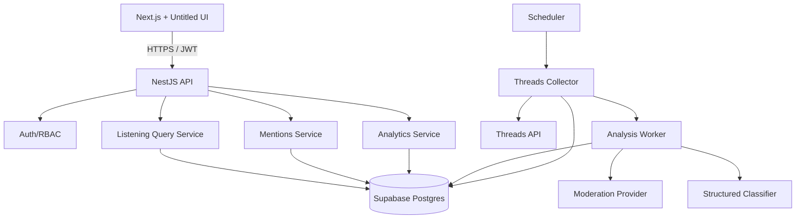

# 02 — Technical Architecture

## 1. Final stack

### Frontend
- Next.js
- TypeScript
- Tailwind CSS
- Untitled UI React
- App Router recommended

### Backend
- NestJS
- TypeScript
- REST API
- `@nestjs/schedule` or equivalent scheduling abstraction for MVP
- Worker/service abstraction for collector and analyzer

### Data
- Supabase Postgres
- Recommended: Prisma ORM
- Supabase Auth recommended
- JSONB only where provider/model payload flexibility is useful
- normalized columns/tables for fields needed by filters/aggregations

### AI
- OpenAI Moderation API as initial safety provider
- Configurable structured-output classifier for relevance/sentiment/intent/topic/language/summary

---

## 2. High-level architecture



---

## 3. Architectural principles

1. FE never calls Threads API directly.
2. FE never receives provider secrets.
3. FE should call NestJS for product business data.
4. Supabase is the persistence layer, not the place where business logic is duplicated.
5. Threads integration is behind an adapter.
6. AI providers are behind interfaces.
7. Jobs are idempotent.
8. All external API failures are observable.
9. Classification is versioned.
10. Raw provider payloads are secondary/debug data; normalized schema drives product queries.
11. Exact provider limits are treated as runtime configuration, not assumptions.
12. Every analytics metric can be traced back to source post IDs.

---

## 4. Suggested repository layout

A monorepo is recommended but not required.

```text
apps/
  web/
    app/
    components/
    features/
    lib/
    styles/

  api/
    src/
      modules/
      common/
      config/
      jobs/

packages/
  contracts/
  taxonomy/
  eslint-config/
  tsconfig/
```

If the existing organization already uses Turborepo, this project fits well into that setup.

### Shared contract package

`packages/contracts` may contain:
- request/response types
- enums
- Zod schemas
- generated OpenAPI client types

Avoid sharing NestJS entities/ORM internals directly with FE.

---

## 5. Next.js frontend architecture

Suggested feature folders:

```text
features/
  analytics/
  mentions/
  listening-queries/
  integrations/
  reviews/
  system-status/
  auth/
```

### Data fetching

Recommended:
- Server Components for shell/static configuration where useful.
- TanStack Query for highly interactive filters/tables, mutations and refetching.
- Avoid duplicating the same query in server and client unnecessarily.

### Untitled UI

Use Untitled UI for:
- app shell/sidebar
- buttons
- inputs
- badges
- tables
- date pickers
- dropdown/select
- dialogs
- tabs
- pagination
- alerts
- charts/dashboard primitives when suitable

Current Untitled UI React supports Next.js and Tailwind CSS and includes an official Next.js setup path.

### Routes

```text
/
  /overview
  /mentions
  /mentions/[id]
  /listening-queries
  /reviews              # P1
  /system-status
  /settings
  /settings/integrations
```

---

## 6. NestJS module design

Recommended modules:

```text
AppModule
├ AuthModule
├ UsersModule
├ ProjectsModule
├ IntegrationsModule
│  └ ThreadsModule
├ ListeningQueriesModule
├ CollectorModule
├ AnalysisModule
├ MentionsModule
├ AnalyticsModule
├ ReviewsModule
├ SyncJobsModule
├ ExportModule
├ AuditModule
└ HealthModule
```

### ThreadsModule

Responsibilities:
- OAuth/token-related provider operations.
- Keyword search adapter.
- pagination.
- provider error mapping.
- rate-limit metadata.
- provider DTO → internal normalized DTO.

Do not put database analytics logic in `ThreadsModule`.

### CollectorModule

Responsibilities:
- schedule.
- determine search window.
- run active queries.
- idempotent ingestion.
- dedupe.
- write sync-job metrics.
- trigger analysis.

### AnalysisModule

Responsibilities:
- analysis queue/state.
- provider abstraction.
- moderation.
- structured classifier.
- policy mapping.
- versioning.
- re-analysis.
- retries/dead-letter state.

### AnalyticsModule

Responsibilities:
- stable metric definitions.
- timeseries bucketing.
- distribution queries.
- previous-period comparison.
- aggregate cache/table when needed.

---

## 7. Threads integration design

### 7.1 Provider interface

Conceptual interface:

```ts
interface SocialDiscoveryProvider {
  search(input: SearchInput): Promise<SearchPage>;
}
```

Threads-specific implementation:

```ts
class ThreadsDiscoveryProvider implements SocialDiscoveryProvider
```

Search input:

```ts
type SearchInput = {
  query: string;
  searchMode: "KEYWORD" | "TAG";
  searchType: "TOP" | "RECENT";
  since?: Date;
  until?: Date;
  limit?: number;
  cursor?: string;
};
```

Output must be provider-neutral.

### 7.2 Fields

Request only fields the product needs. This reduces payload size and limits unnecessary retention.

Candidate fields include:
- id
- media_type
- media_url
- permalink
- username
- text
- timestamp
- shortcode
- thumbnail_url
- is_quote_post
- quoted_post
- reposted_post
- has_replies
- alt_text
- link_attachment_url

Actual field list must be verified against the API version used in production.

### 7.3 Search mode mapping

```text
query_type=keyword   → search_mode=KEYWORD
query_type=topic_tag → search_mode=TAG
```

### 7.4 Search type

Scheduled listening:
`RECENT`

Optional exploration/backfill:
- `RECENT`
- `TOP` when explicitly useful

Do not mix TOP results into time-series totals without deduplication and clear time-window filtering.

---

## 8. Scheduler and job execution

### 8.1 MVP scheduling

Recommended:
- persistent NestJS worker/service
- scheduler checks due queries every minute
- each query has `next_run_at`

This is more flexible than defining one cron expression per keyword.

### 8.2 Distributed execution

If more than one NestJS instance runs jobs:
- use Postgres advisory lock or a durable job-claim mechanism
- do not rely on in-memory mutex

Example concept:

```text
UPDATE listening_queries
SET locked_at = now(), locked_by = worker_id
WHERE id = ?
  AND next_run_at <= now()
  AND lock is stale/free
RETURNING *
```

or use Postgres advisory locks.

### 8.3 Job states

```text
queued
running
success
partial
failed
cancelled
```

### 8.4 Analysis states

```text
pending
processing
completed
failed
skipped
stale
```

### 8.5 Retry policy

Example:
- 429/5xx/timeouts: retry
- 400 validation: do not retry blindly
- 401: attempt token-refresh flow if supported; otherwise mark integration action required
- 403: mark permission/configuration error
- model/provider transient: retry
- malformed model result: retry with structured-output correction once, then fail

All retry counts configurable.

---

## 9. Ingestion idempotency

Required database uniqueness:

```text
UNIQUE(platform, platform_post_id)
UNIQUE(post_id, listening_query_id)
```

Upsert behavior:
- existing unchanged post: only update `last_seen_at`
- existing changed post: update content, revision/hash, set analysis stale
- new query match: insert match without duplicating post

---

## 10. Analysis architecture

### 10.1 Safety

Initial provider:
OpenAI Moderation API.

Store:
- provider flagged bool
- provider category booleans
- category scores
- product safety level
- product safety policy version

The moderation endpoint can accept multiple inputs; batching can be introduced if useful.

### 10.2 Structured classifier

One structured request should ideally produce:

```json
{
  "relevance": {
    "label": "relevant",
    "confidence": 0.97,
    "explanation": "Directly discusses Eventista ticket pricing."
  },
  "sentiment": {
    "label": "negative",
    "confidence": 0.91
  },
  "intents": [
    {"label": "complaint", "confidence": 0.95}
  ],
  "topics": [
    {"label": "ticket", "confidence": 0.98},
    {"label": "price", "confidence": 0.96}
  ],
  "language": "vi",
  "summary": "User complains that Eventista ticket prices are too high."
}
```

Validate with a strict JSON schema.

### 10.3 Cost optimization

Recommended order:
1. lightweight normalization
2. relevance
3. skip expensive classifier for clearly irrelevant content
4. batch moderation where useful
5. classify relevant/uncertain content only
6. never analyze the same content_hash with the same analysis version twice

### 10.4 Version keys

An effective analysis version should include:

```text
classifier_provider
classifier_model
prompt_version
taxonomy_version
safety_provider
safety_model
safety_policy_version
```

Any incompatible change can mark prior records stale.

---

## 11. Taxonomy configuration

MVP can keep taxonomy definitions in version-controlled code.

Example:

```ts
export const INTENTS = [...]
export const TOPICS = [...]
```

Persist `taxonomy_version`.

P2 can move these into DB-managed custom taxonomies.

Do not permit arbitrary runtime taxonomy edits in MVP unless re-analysis behavior and historical reporting semantics are solved.

---

## 12. Supabase design

### 12.1 Responsibilities

Use Supabase for:
- Postgres
- Auth (recommended)
- optional Storage only if later needed for generated exports
- optional Realtime only if the product truly needs live dashboard refresh

Do not use Supabase Storage for downloaded Threads media in MVP.

### 12.2 FE access model

Recommended:
- FE uses Supabase Auth client for session/authentication.
- FE calls NestJS for product APIs.
- NestJS validates Supabase JWT.
- NestJS accesses Postgres securely.

The Supabase anon key can exist in FE when required by Supabase Auth.
The Supabase service-role key must never exist in FE.

### 12.3 Connection management

NestJS should use:
- Supabase-supported Postgres connection/pooler appropriate to deployment
- conservative pool size
- connection health checks

If deploying serverless NestJS, connection pooling becomes mandatory.

---

## 13. Authentication and authorization

### 13.1 JWT flow

```text
Browser
  ↓ login
Supabase Auth
  ↓ JWT
Browser
  ↓ Authorization: Bearer <JWT>
NestJS
  ↓ verify
RBAC Guard
```

### 13.2 RBAC enforcement

Every write endpoint must enforce role in NestJS.

FE hiding a button is not authorization.

### 13.3 Audit log

Audit at least:
- integration changes
- query create/edit/delete
- manual sync/backfill
- re-analysis
- manual override
- role change

---

## 14. Secret management

Secrets:
- Threads app secret
- Threads user access token / refresh material
- OpenAI API key
- Supabase service credentials
- encryption keys

Requirements:
- never log raw secret values
- never return them from API
- encrypt persistent provider tokens
- use a managed secret store when deployment platform provides one
- rotate without code change

If the Threads token must be updated after refresh, use a secure mutable secret store or encrypted server-side persistence.

---

## 15. Observability

### 15.1 Structured logs

Log fields:
- request_id
- job_id
- query_id
- project_id
- provider
- status
- duration_ms
- result_count
- error_code

Do not log full access tokens.

### 15.2 Metrics

Collector:
- sync jobs total
- sync success rate
- provider request latency
- posts fetched
- posts inserted
- duplicates
- rate-limit events
- collection lag

Analyzer:
- pending
- processing
- completed
- failed
- duration
- classification calls
- moderation calls
- tokens if applicable
- estimated AI cost
- analysis lag

API:
- request count
- 4xx/5xx
- p50/p95 latency

DB:
- connections
- storage usage
- slow queries
- CPU/memory when available

### 15.3 Health endpoints

```text
GET /health/live
GET /health/ready
```

Readiness should include required dependencies, but avoid making temporary AI-provider degradation take the entire read-only dashboard offline.

---

## 16. Non-functional requirements

### 16.1 Performance targets

Initial targets:

- Overview API p95: < 1.5 s for common 24h/7d ranges
- Mentions list p95: < 1.0 s for indexed filters
- Mention detail p95: < 700 ms
- FE initial dashboard usable state: target < 2.5 s on normal office broadband after auth
- Collector should process pages without blocking user-facing HTTP workers

These are product targets, not provider latency guarantees.

### 16.2 Availability

Internal MVP target:
- 99.5% application availability is sufficient
- ingestion failures must be recoverable/backfillable

### 16.3 Data consistency

Analytics can be eventually consistent.
A newly ingested post may appear before classification completes.

UI must show:
- pending analysis
- completed analysis
- failed analysis

### 16.4 Scalability

MVP should comfortably support:
- at least hundreds of active listening queries in schema/design
- millions of stored posts over time
- horizontal API scaling
- separate worker scaling

Actual POC load is likely much smaller for initial 1Zone/Eventista terms.

---

## 17. Query/index strategy

Critical indexed dimensions:
- project_id
- platform
- platform_post_id
- published_at
- first_seen_at
- relevance
- sentiment
- safety_level
- language
- analysis_status

Join/index:
- post/query match
- analysis intent label
- analysis topic label

Text search:
- MVP: PostgreSQL full-text search or `ILIKE` for low volume
- Recommended at meaningful volume: Postgres full-text + GIN index
- Do not add Elasticsearch/OpenSearch before Postgres search is proven insufficient

---

## 18. Aggregation strategy

### Phase 1
Query indexed raw tables for dashboard.

### Phase 1.5
When dataset/query cost grows:
- daily/hourly aggregate tables or materialized views
- refresh incrementally
- keep raw data as source of truth

Possible buckets:
- hour
- day

Dimensions:
- project
- query
- sentiment
- safety
- intent
- topic
- language

Do not prematurely create a combinatorial aggregate cube for every dimension.

---

## 19. Caching

MVP:
- short API cache for overview queries is optional
- browser query cache through TanStack Query

Do not cache filtered mention lists for long periods because analysts expect newly collected posts.

Suggested:
- overview cache: 30–60 seconds
- system status: 10–30 seconds
- mention list: short/stale-while-refresh behavior

---

## 20. Time handling

Database:
- store timestamps as `timestamptz` in UTC

Project setting:
- timezone string

Default:
`Asia/Ho_Chi_Minh`

API may accept ISO-8601 times.

Analytics bucketing:
- apply selected/project timezone consistently
- document boundary behavior

---

## 21. Data retention

Recommended configurable policy.

Initial assumption for planning:
- normalized posts + analysis: 12 months
- sync/audit operational logs: 90–180 days depending volume
- aggregate analytics can be retained longer
- no binary media

Before production launch:
- verify retention behavior against Meta Platform Terms and organizational requirements
- provide deletion/purge tooling
- support purging data for a post/project/date range

Do not make retention irreversible in schema design.

---

## 22. Compliance and data minimization

- Use official API, not scraping, for MVP.
- Store only data required for product purpose.
- Avoid profile enrichment unrelated to analysis.
- Keep original permalink for traceability.
- Support deletion/purge.
- Restrict access to internal roles.
- Record policy/version used for automated safety classifications.
- Treat public content as user-generated content, not as proprietary first-party user data.

---

## 23. Failure-state UX

Frontend must distinguish:

### No mentions
```text
No relevant mentions found in this period.
```

### Collection failed
```text
Latest Threads sync failed. Data may be incomplete.
```

### Analysis pending
```text
124 mentions are waiting for analysis.
```

### Integration expired
```text
Threads connection needs attention.
```

Do not show “0 negative mentions” when the analyzer has not run.

---

## 24. Testing requirements

### Unit tests
- query window calculation
- dedupe identity
- safety-level mapping
- taxonomy validation
- metric denominators
- RBAC
- previous-period math
- parsing/provider DTO normalization

### Integration tests
- Threads provider mocked contract
- Supabase/Postgres upsert
- pagination
- retry
- duplicate query matches
- analysis versioning
- re-analysis
- manual override

### E2E
- login
- dashboard
- add query
- run sync (mock/test provider)
- mention appears
- filter dashboard
- open detail
- role restrictions

### Contract tests
Persist fixtures from representative Threads API responses so provider changes can be detected.

### AI evaluation
Create a labeled evaluation set containing:
- Vietnamese positive/neutral/negative
- sarcasm
- slang
- mixed Vietnamese/English
- complaints
- ticket price
- artist discussions
- spam
- sensitive content
- irrelevant `1zone` false positives

Track accuracy separately for:
- relevance
- sentiment
- intent
- topic
- safety policy mapping

---

## 25. Deployment requirements

Specific cloud hosting is intentionally not locked in yet.

Need:
- Next.js hosting
- persistent or reliably scheduled NestJS API/worker
- secure environment secrets
- outbound access to Threads/OpenAI/Supabase
- HTTPS
- logs/monitoring
- staging and production environments

Recommended environments:

```text
local
staging
production
```

Each environment uses separate:
- Supabase project/database or isolated database
- Meta app/token as appropriate
- AI project/key
- secrets

Never test destructive/backfill logic directly against production first.
