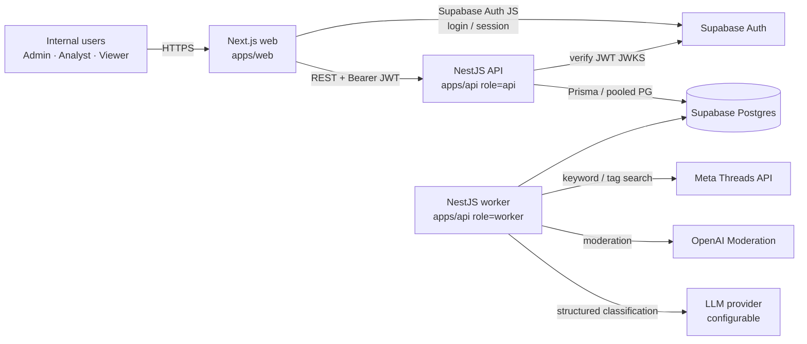
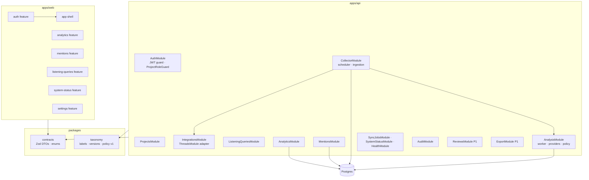
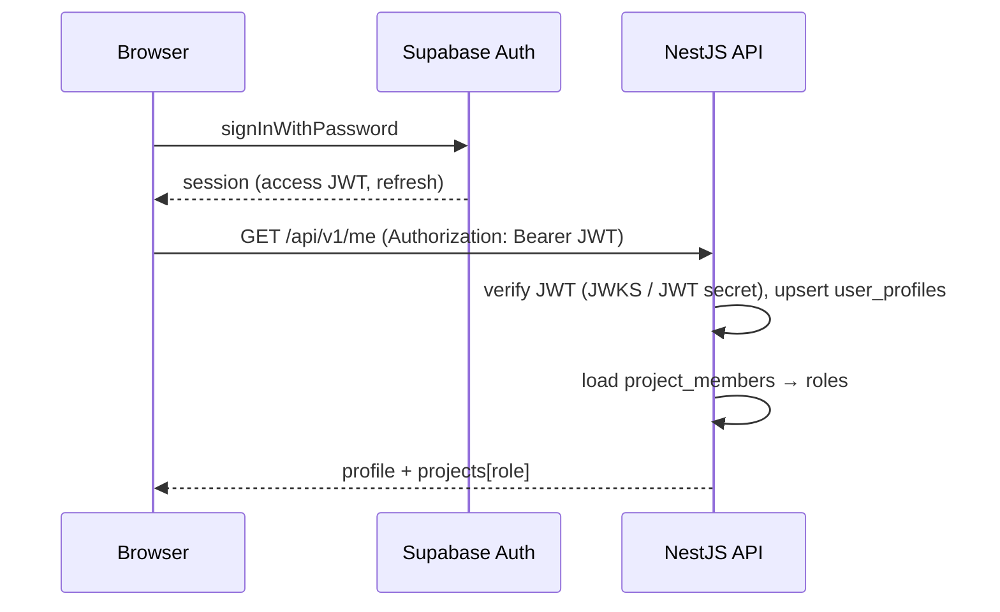
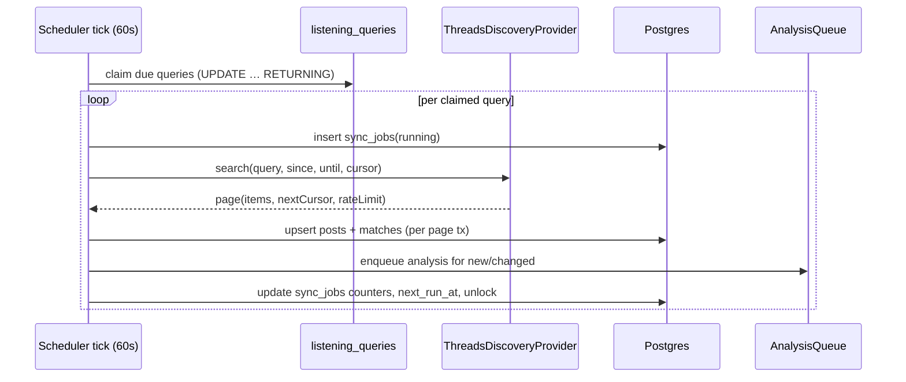
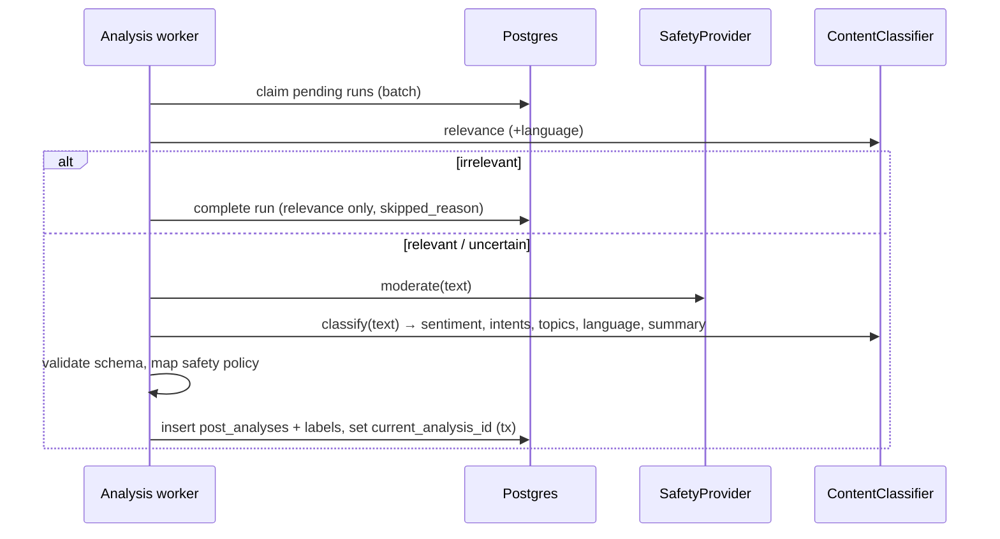

# 01 · System Overview

| Field     | Value                                                                                                                                                                                        |
| --------- | -------------------------------------------------------------------------------------------------------------------------------------------------------------------------------------------- |
| Status    | Approved (baseline v1.0)                                                                                                                                                                     |
| Source    | [00-source/02_TECHNICAL_ARCHITECTURE.md](../00-source/02_TECHNICAL_ARCHITECTURE.md) §1–§4, §12 · [00-source/04_OPERATIONS_COSTS_ROADMAP.md](../00-source/04_OPERATIONS_COSTS_ROADMAP.md) §11 |
| Decisions | [adr/](adr/README.md)                                                                                                                                                                        |

## 1. Stack (frozen)

| Layer    | Choice                                                                                                                                           | Version policy                        |
| -------- | ------------------------------------------------------------------------------------------------------------------------------------------------ | ------------------------------------- |
| Frontend | Next.js (App Router) · React 19 · TypeScript · Tailwind CSS v4 · Untitled UI React (React Aria) · TanStack Query · Recharts · nuqs               | Next 16.x, TS 5.9                     |
| Backend  | NestJS 11 · TypeScript · REST (`/api/v1`) · `@nestjs/schedule` · Prisma 6 · pino                                                                 | Node 24 LTS-track                     |
| Data     | Supabase Postgres 15+ · Supabase Auth (JWT)                                                                                                      | Free (local/POC) → Pro (staging/prod) |
| AI       | OpenAI Moderation `omni-moderation-latest` (safety) · configurable structured-output LLM (classifier) behind interfaces                          | provider/model from env               |
| Tooling  | pnpm workspaces · Turborepo · ESLint 9 · Prettier · Husky · commitlint · Jest (api) · Vitest (web, packages) · Playwright (e2e) · GitHub Actions | —                                     |

## 2. Context diagram

The same NestJS build runs as `api`, `worker`, or `all` (`APP_ROLE`). MVP deploys one `all` instance; scaling splits roles.

## 3. Container / module diagram

## 4. Architectural principles (binding)

1. FE never calls Threads/OpenAI; FE never holds provider secrets or the service-role key.
2. FE authenticates with Supabase Auth and calls NestJS for all business data.
3. Business logic lives in NestJS services; Supabase is storage + auth (no RLS-based business logic in MVP; DB accessed with a dedicated Postgres role, not the anon key).
4. Provider adapters: `SocialDiscoveryProvider` (Threads), `SafetyProvider`, `ContentClassifier`. Domain code depends on interfaces only.
5. Jobs are idempotent and claim work through the database (no in-memory locks, no Redis).
6. Classification results are versioned and never overwritten; re-analysis appends runs.
7. Every external failure is observable (structured log + job record + status endpoint).
8. Normalised columns drive queries; JSONB is for provider payloads and score maps only.
9. Provider limits are runtime configuration; nothing about Meta quota is assumed in code.
10. Every metric is reproducible from source post ids (drill-down equivalence).

## 5. Key flows

### 5.1 Login & request

### 5.2 Scheduled collection

### 5.3 Analysis

## 6. Deployment view (MVP)

| Component                   | Where (assumption)                                    | Notes                                                                   |
| --------------------------- | ----------------------------------------------------- | ----------------------------------------------------------------------- |
| `apps/web`                  | Vercel (or any Node host)                             | env: Supabase URL + anon key, API base URL                              |
| `apps/api` (`APP_ROLE=all`) | Persistent Node host (Railway / Fly.io / Render / VM) | needs outbound HTTPS, secrets, 1 instance MVP; DB claiming makes N safe |
| Postgres + Auth             | Supabase project per environment                      | pooler (transaction mode) for API, session mode for migrations          |
| Secrets                     | Host secret manager                                   | see [08-security-secrets.md](08-security-secrets.md)                    |
| CI/CD                       | GitHub Actions                                        | see [../06-engineering/07-ci-cd.md](../06-engineering/07-ci-cd.md)      |

## 7. Non-goals of the architecture (MVP)

No Redis, Kafka, OpenSearch, serverless functions for workers, GraphQL, or Supabase Edge Functions for business logic. Revisit only with measured need ([ADR-0005](adr/0005-postgres-first-no-queue-infra.md)).
