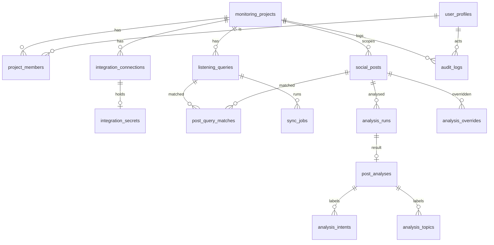

# 04 · Data Model

| Field  | Value                                                                                                                   |
| ------ | ----------------------------------------------------------------------------------------------------------------------- |
| Status | Approved (baseline v1.0)                                                                                                |
| Source | [00-source/03_DATA_MODEL_AND_API.md](../00-source/03_DATA_MODEL_AND_API.md) §1–§5, §18–§20                              |
| Code   | `apps/api/prisma/schema.prisma`, `apps/api/prisma/migrations/`, `apps/api/prisma/seed.ts`                               |
| Rules  | [../01-product/06-business-rules-glossary.md](../01-product/06-business-rules-glossary.md) BR-001…BR-003, BR-023…BR-026 |

## 1. Principles

Historical persistence · stable provider identity · posts separated from matches and from analysis · versioned analysis · normalised filter columns, JSONB only for provider payloads/score maps · `project_id` everywhere · soft delete for configuration · UUID PKs (`uuid v7` generated in app) · provider ids as `text` · all timestamps `timestamptz` UTC.

## 2. ERD



## 3. Enums

| Enum                 | Values                                                                  |
| -------------------- | ----------------------------------------------------------------------- |
| `platform`           | `threads` (future `x`, `reddit`, …)                                     |
| `query_type`         | `keyword`, `topic_tag`                                                  |
| `search_mode`        | `KEYWORD`, `TAG`                                                        |
| `search_type`        | `RECENT`, `TOP`                                                         |
| `user_role`          | `admin`, `analyst`, `viewer`                                            |
| `integration_status` | `disconnected`, `connected`, `expired`, `permission_error`, `error`     |
| `job_status`         | `queued`, `running`, `success`, `partial`, `failed`, `cancelled`        |
| `job_trigger`        | `scheduled`, `manual`, `backfill`, `retry`                              |
| `analysis_status`    | `pending`, `processing`, `completed`, `failed`, `skipped`, `stale`      |
| `analysis_trigger`   | `ingest`, `content_change`, `manual`, `bulk`, `retry`, `version_change` |
| `relevance_label`    | `relevant`, `uncertain`, `irrelevant`                                   |
| `sentiment_label`    | `positive`, `neutral`, `negative`                                       |
| `safety_level`       | `safe`, `sensitive`, `severe`                                           |
| `override_field`     | `relevance`, `sentiment`, `safety_level`, `intents`, `topics`           |

## 4. Tables

### 4.1 `monitoring_projects`

| Column                  | Type                               | Notes                                        |
| ----------------------- | ---------------------------------- | -------------------------------------------- |
| id                      | uuid PK                            |                                              |
| name                    | text NN                            |                                              |
| slug                    | text UNIQUE NN                     | `1zone-eventista`                            |
| description             | text                               |                                              |
| timezone                | text NN default `Asia/Ho_Chi_Minh` | IANA                                         |
| settings                | jsonb NN default `{}`              | `allowAnalystReanalyze`, `allowViewerExport` |
| is_active               | boolean NN default true            |                                              |
| created_at / updated_at | timestamptz NN                     |                                              |

### 4.2 `user_profiles`

| id uuid PK (= auth.users.id) · email text NN UNIQUE · display_name text · avatar_url text · last_login_at timestamptz · created_at / updated_at |

### 4.3 `project_members`

| project_id uuid FK · user_id uuid FK · role user_role NN · invited_email text · created_by uuid · created_at / updated_at · **PK (project_id, user_id)** |
Invitations before first login: row keyed by a placeholder profile created from email (id generated); reconciled on first login by email match.

### 4.4 `integration_connections`

| id uuid PK · project_id FK · platform NN · status integration_status NN default `disconnected` · account_identifier text · granted_scopes text[] · token_expires_at · last_verified_at · last_success_at · last_error_code text · last_error_message text · created_at / updated_at · **UNIQUE (project_id, platform)** |

### 4.5 `integration_secrets`

| id uuid PK · connection_id uuid FK UNIQUE · key_id text NN (encryption key version) · ciphertext bytea NN · iv bytea NN · auth_tag bytea NN · rotated_at · created_at |
Never selected by list endpoints; only `ThreadsTokenStore` reads it.

### 4.6 `listening_queries`

| Column                                               | Type                            | Notes          |
| ---------------------------------------------------- | ------------------------------- | -------------- |
| id                                                   | uuid PK                         |                |
| project_id                                           | uuid FK NN                      |                |
| platform                                             | platform NN default `threads`   |                |
| display_name                                         | text NN                         |                |
| query_value                                          | text NN                         | no leading `#` |
| query_type                                           | query_type NN                   |                |
| search_mode                                          | search_mode NN                  | derived BR-005 |
| scheduled_search_type                                | search_type NN default `RECENT` |                |
| enabled                                              | boolean NN default true         |                |
| exclude_terms / include_terms                        | text[] NN default `{}`          |                |
| poll_interval_seconds                                | int NN default 600              | 60–86400       |
| overlap_seconds                                      | int NN default 1200             |                |
| initial_backfill_days                                | int NN default 1                | 0–30           |
| next_run_at                                          | timestamptz                     |                |
| last_run_at                                          | timestamptz                     |                |
| last_successful_sync_at                              | timestamptz                     |                |
| last_error_at / last_error_code / last_error_message |                                 |                |
| consecutive_failures                                 | int NN default 0                | backoff        |
| locked_at / locked_by                                | timestamptz / text              | claiming       |
| created_by                                           | uuid                            |                |
| created_at / updated_at / deleted_at                 |                                 |                |

Unique (partial, raw SQL migration): `UNIQUE (project_id, platform, query_type, lower(query_value)) WHERE deleted_at IS NULL`.
Index: `(project_id, enabled, next_run_at) WHERE deleted_at IS NULL`.

### 4.7 `social_posts`

| Column                            | Type                                                            | Notes                             |
| --------------------------------- | --------------------------------------------------------------- | --------------------------------- |
| id                                | uuid PK                                                         |                                   |
| project_id                        | uuid FK NN                                                      |                                   |
| platform                          | platform NN                                                     |                                   |
| platform_post_id                  | text NN                                                         |                                   |
| username                          | text                                                            |                                   |
| owner_id                          | text                                                            |                                   |
| text                              | text                                                            | normalised NFC                    |
| permalink                         | text                                                            |                                   |
| shortcode                         | text                                                            |                                   |
| media_type                        | text                                                            |                                   |
| media_url / thumbnail_url         | text                                                            | URLs only                         |
| alt_text                          | text                                                            |                                   |
| link_attachment_url               | text                                                            |                                   |
| is_quote_post / has_replies       | boolean                                                         |                                   |
| quoted_post_id / reposted_post_id | text                                                            |                                   |
| published_at                      | timestamptz NN                                                  |                                   |
| content_hash                      | text NN                                                         | BR-003                            |
| revision                          | int NN default 1                                                |                                   |
| raw_data                          | jsonb                                                           | requested fields only             |
| raw_truncated                     | boolean NN default false                                        |                                   |
| current_analysis_id               | uuid FK → post_analyses.id (deferrable)                         | latest completed                  |
| latest_run_status                 | analysis_status                                                 | denormalised for filters/coverage |
| search_vector                     | tsvector GENERATED (`to_tsvector('simple', coalesce(text,''))`) | GIN                               |
| first_seen_at / last_seen_at      | timestamptz NN                                                  |                                   |
| created_at / updated_at           |                                                                 |                                   |

Unique `(platform, platform_post_id)`. Indexes: `(project_id, published_at DESC)`, `(project_id, first_seen_at DESC)`, `(project_id, latest_run_status)`, `(project_id, current_analysis_id)`, GIN `search_vector`.

### 4.8 `post_query_matches`

| post_id uuid FK · query_id uuid FK · first_matched_at NN · last_matched_at NN · excluded_by_terms boolean NN default false · **PK (post_id, query_id)** · index `(query_id, post_id) WHERE NOT excluded_by_terms` |

### 4.9 `sync_jobs`

| id uuid PK · project_id FK · query_id FK · status job_status NN · trigger job_trigger NN · search_type NN · search_mode NN · window_since / window_until timestamptz · started_at / completed_at · pages_fetched, records_fetched, records_inserted, records_updated, records_duplicated, records_invalid, records_excluded int NN default 0 · provider_requests int NN 0 · rate_limit_events int NN 0 · provider_usage jsonb · last_cursor text · error_code / error_message text · requested_by uuid · locked_by text · created_at |
Indexes: `(project_id, created_at DESC)`, `(query_id, created_at DESC)`, `(status)`.

### 4.10 `analysis_runs`

| id uuid PK · post_id FK NN · project_id FK NN · status analysis_status NN · trigger analysis_trigger NN · source_content_hash text NN · source_revision int NN · effective_version text NN (BR-023 key) · classifier_provider / classifier_model / prompt_version / taxonomy_version · safety_provider / safety_model / safety_policy_version · started_at / completed_at · input_tokens / output_tokens int · estimated_cost_usd numeric(12,6) · attempt_count int NN 0 · skipped_reason text · error_code / error_message text · locked_at / locked_by · requested_by uuid · created_at |
Indexes: `(post_id, created_at DESC)`, `(status, created_at)`, `(source_content_hash, effective_version)`, `(project_id, status)`.
Uniqueness (soft, enforced in service): one `completed` run per `(post_id, source_content_hash, effective_version)` unless `trigger='manual'`.

### 4.11 `post_analyses`

| id uuid PK · analysis_run_id uuid FK UNIQUE · post_id FK NN · project_id FK NN · relevance_label / relevance_confidence numeric(5,4) / relevance_explanation · sentiment_label / sentiment_confidence · safety_level / safety_flagged boolean / safety_category_scores jsonb · language_code text · summary text · overall_model_confidence numeric(5,4) · created_at |
Indexes: `(post_id)`, `(project_id, relevance_label)`, `(project_id, sentiment_label)`, `(project_id, safety_level)`, `(project_id, language_code)`.

### 4.12 `analysis_intents` / `analysis_topics`

| analysis_id uuid FK · label text NN · confidence numeric(5,4) · **PK (analysis_id, label)** · index `(label, analysis_id)` |

### 4.13 `analysis_overrides` (P1)

| id uuid PK · post_id FK NN · project_id FK NN · analysis_id FK · field override_field NN · previous_value jsonb · override_value jsonb NN · reason text · reviewed_by uuid NN · created_at NN · revoked_at · revoked_by |
Partial unique: `(post_id, field) WHERE revoked_at IS NULL`.

### 4.14 `audit_logs`

| id uuid PK · project_id · actor_user_id · action text NN (`query.created`, `integration.updated`, …) · entity_type text · entity_id text · metadata jsonb · request_id text · created_at NN · index `(project_id, created_at DESC)`, `(action)` |

### 4.15 `analytics_daily` (P1.5)

| bucket_date date · project_id · query_id (nullable = all) · relevant_mentions · positive/neutral/negative_count · safe/sensitive/severe_count · intent_counts jsonb · topic_counts jsonb · language_counts jsonb · refreshed_at · **PK (project_id, bucket_date, coalesce(query_id, '00000000-…'))** |
Raw tables remain the source of truth; refreshed incrementally per day.

## 5. Views

### `effective_post_analysis`

```sql
CREATE VIEW effective_post_analysis AS
SELECT p.id AS post_id, p.project_id, p.published_at, p.latest_run_status,
       COALESCE((o_rel.override_value->>'value')::relevance_label, a.relevance_label) AS relevance_label,
       a.relevance_confidence,
       COALESCE((o_sen.override_value->>'value')::sentiment_label, a.sentiment_label) AS sentiment_label,
       a.sentiment_confidence,
       COALESCE((o_saf.override_value->>'value')::safety_level, a.safety_level) AS safety_level,
       a.language_code, a.summary, a.overall_model_confidence, a.id AS analysis_id,
       (o_rel.id IS NOT NULL OR o_sen.id IS NOT NULL OR o_saf.id IS NOT NULL) AS has_override
FROM social_posts p
LEFT JOIN post_analyses a ON a.id = p.current_analysis_id
LEFT JOIN analysis_overrides o_rel ON o_rel.post_id = p.id AND o_rel.field='relevance' AND o_rel.revoked_at IS NULL
LEFT JOIN analysis_overrides o_sen ON o_sen.post_id = p.id AND o_sen.field='sentiment' AND o_sen.revoked_at IS NULL
LEFT JOIN analysis_overrides o_saf ON o_saf.post_id = p.id AND o_saf.field='safety_level' AND o_saf.revoked_at IS NULL;
```

Intent/topic overrides are resolved by `effective_post_labels(kind)` function (P1) or in service code; MVP without overrides reads `analysis_intents/topics` joined on `current_analysis_id`.

## 6. Prisma mapping notes

- Use `@@map`/`@map` for snake_case tables/columns; enums declared in Prisma.
- Partial unique indexes, generated `tsvector`, the view, and the deferrable FK are raw SQL in `prisma/migrations/20260905120100_init_extras/migration.sql`; `FOR UPDATE SKIP LOCKED` claims are raw SQL in repositories.
- **Known Prisma limitation:** Migrate is declarative and cannot model those objects, so after every `prisma migrate dev` review the generated SQL and delete any `DROP INDEX/COLUMN` targeting `listening_queries_active_unique`, `analysis_runs_open_unique`, `analysis_overrides_active_unique`, `social_posts_search_vector_idx` or the generated `search_vector` column before committing (checklist item in the PR template for `apps/api/prisma/**` changes).
- `current_analysis_id` FK is `DEFERRABLE INITIALLY DEFERRED` to allow insert-then-point in one transaction.
- `prisma/seed.ts`: project, admin membership (from `SEED_ADMIN_EMAIL`), 4 queries, integration connection placeholder (`disconnected`).

## 7. Sizing & retention

Plan single-digit KB per post incl. analysis + indexes; measure `average_storage_bytes_per_post` monthly. Retention & purge in [../05-operations/04-data-retention-purge.md](../05-operations/04-data-retention-purge.md).

## 8. Migration policy

Migrations in VCS, applied by CI/CD (`prisma migrate deploy`); no manual prod edits; taxonomy changes bump versions not schema; destructive migrations need backup + approval ([../06-engineering/04-git-workflow.md](../06-engineering/04-git-workflow.md)).
