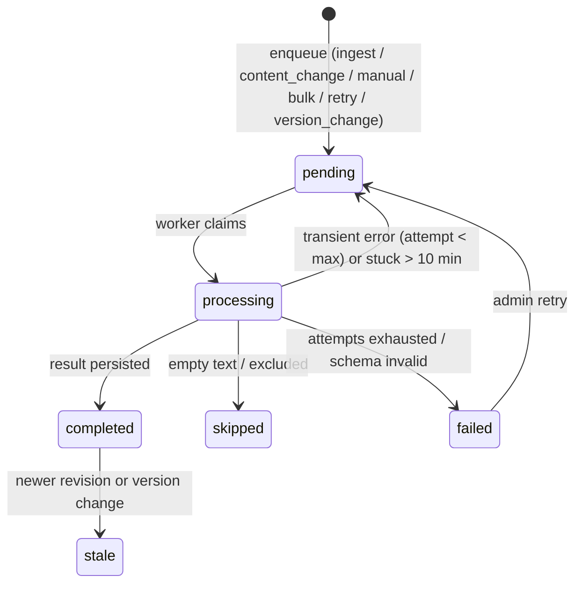

# 07 · Analysis Pipeline (Content Intelligence)

| Field  | Value                                                                                                                                                                                                                                                                      |
| ------ | -------------------------------------------------------------------------------------------------------------------------------------------------------------------------------------------------------------------------------------------------------------------------- |
| Status | Approved (baseline v1.0)                                                                                                                                                                                                                                                   |
| Source | [00-source/01_PRODUCT_REQUIREMENTS.md](../00-source/01_PRODUCT_REQUIREMENTS.md) §9–§10 · [00-source/02_TECHNICAL_ARCHITECTURE.md](../00-source/02_TECHNICAL_ARCHITECTURE.md) §10–§11 · [00-source/03_DATA_MODEL_AND_API.md](../00-source/03_DATA_MODEL_AND_API.md) §16–§18 |
| Code   | `apps/api/src/modules/analysis/`, `packages/taxonomy`                                                                                                                                                                                                                      |
| Rules  | BR-016…BR-027 · FR-100…FR-119 · [../01-product/08-taxonomy-classification.md](../01-product/08-taxonomy-classification.md)                                                                                                                                                 |

## 1. State machine



## 2. Processing order

```text
claim batch (FOR UPDATE SKIP LOCKED, status=pending, ORDER BY created_at, LIMIT ANALYSIS_BATCH_SIZE)
for each run (bounded concurrency ANALYSIS_CONCURRENCY):
  load post text (revision must equal run.source_revision else mark skipped 'superseded')
  if text empty → skipped (reason 'empty_text')
  step 1  relevance (+language)      ← ContentClassifier.relevance()   [small prompt]
  if irrelevant → complete(relevance, language only; skipped_reason 'irrelevant')
  step 2  safety                     ← SafetyProvider.moderate(text)
  step 3  structured classification  ← ContentClassifier.classify(text, hints{language})
  validate schema; map safety policy; compute bands
  tx: insert post_analyses (+ intents/topics) ; update run completed ; set posts.current_analysis_id, latest_run_status
```

Implementation note: v1 may merge step 1 and 3 into one structured call when the provider supports it cheaply; the relevance gate is then applied to the response (skip summary storage for irrelevant). The interface keeps both entry points so the cheap two-step path can be enabled by config `ANALYSIS_TWO_STEP=true`.

## 3. Provider interfaces

```ts
export interface SafetyProvider {
  readonly name: string;
  readonly model: string;
  moderate(input: { text: string }, ctx: AnalysisContext): Promise<SafetyProviderResult>;
}
export type SafetyProviderResult = {
  flagged: boolean;
  categoryScores: Record<string, number>;
  categories: Record<string, boolean>;
  raw?: unknown;
};

export interface ContentClassifier {
  readonly provider: string;
  readonly model: string;
  readonly promptVersion: string;
  relevance(input: ClassifierInput, ctx): Promise<RelevanceResult & { language?: string; usage: Usage }>;
  classify(input: ClassifierInput, ctx): Promise<ClassifierOutput & { usage: Usage }>;
}
export type ClassifierInput = {
  text: string;
  username?: string;
  matchedTerms: string[];
  brandContext: string;
  languageHint?: string;
};
export type Usage = { inputTokens: number; outputTokens: number; estimatedCostUsd: number };
```

Implementations: `OpenAiModerationProvider` (`omni-moderation-latest`), `OpenAiStructuredClassifier` (model from `ANALYSIS_CLASSIFIER_MODEL`, JSON-schema structured outputs, temperature 0), `FakeSafetyProvider`, `FakeContentClassifier` (deterministic by hash, for tests/local). Provider selection via `ANALYSIS_CLASSIFIER_PROVIDER`, `SAFETY_PROVIDER`. No other module imports these classes.

## 4. Classifier output JSON schema (strict)

```json
{
  "$schema": "https://json-schema.org/draft/2020-12/schema",
  "type": "object",
  "additionalProperties": false,
  "required": ["relevance", "sentiment", "intents", "topics", "language", "summary"],
  "properties": {
    "relevance": {
      "type": "object",
      "additionalProperties": false,
      "required": ["label", "confidence", "explanation"],
      "properties": {
        "label": { "enum": ["relevant", "uncertain", "irrelevant"] },
        "confidence": { "type": "number", "minimum": 0, "maximum": 1 },
        "explanation": { "type": "string", "maxLength": 200 }
      }
    },
    "sentiment": {
      "type": "object",
      "additionalProperties": false,
      "required": ["label", "confidence"],
      "properties": {
        "label": { "enum": ["positive", "neutral", "negative"] },
        "confidence": { "type": "number", "minimum": 0, "maximum": 1 }
      }
    },
    "intents": {
      "type": "array",
      "minItems": 1,
      "maxItems": 4,
      "items": {
        "type": "object",
        "additionalProperties": false,
        "required": ["label", "confidence"],
        "properties": {
          "label": {
            "enum": [
              "praise",
              "complaint",
              "question",
              "recommendation",
              "purchase_intent",
              "boycott",
              "spam",
              "information",
              "support_request",
              "comparison",
              "other"
            ]
          },
          "confidence": { "type": "number", "minimum": 0, "maximum": 1 }
        }
      }
    },
    "topics": {
      "type": "array",
      "minItems": 1,
      "maxItems": 4,
      "items": {
        "type": "object",
        "additionalProperties": false,
        "required": ["label", "confidence"],
        "properties": {
          "label": {
            "enum": [
              "artist",
              "ticket",
              "venue",
              "price",
              "performance",
              "membership",
              "payment",
              "queue",
              "customer_service",
              "event",
              "merchandise",
              "other"
            ]
          },
          "confidence": { "type": "number", "minimum": 0, "maximum": 1 }
        }
      }
    },
    "language": { "enum": ["vi", "en", "ko", "ja", "th", "zh", "other", "unknown"] },
    "summary": { "type": "string", "maxLength": 240 }
  }
}
```

The Zod equivalent lives in `packages/contracts/src/analysis/classifier-output.ts` and is generated into the provider request (`response_format: json_schema, strict: true`). Post-validation rules: `other` exclusive (drop `other` if other labels exist, else keep); dedupe labels; clamp confidences.

## 5. Prompt v1 (`classifier-v1`) — outline

System: role (social-listening analyst for **1Zone / Eventista**, Vietnamese live-event & ticketing brand), the brand context paragraph (configurable `ANALYSIS_BRAND_CONTEXT`), taxonomy definitions (from `packages/taxonomy` guides), rules: judge intended attitude (sarcasm), multi-label allowed, `other` exclusive, summary in English one sentence, never include reasoning, output strictly as schema. User: matched terms, username (optional), post text delimited. Few-shot: 6 short VI/EN examples covering false-positive `1zone` (time zone), complaint about price, praise for artist, spam scalper, question about ticket sale, sensitive content. Full prompt text is versioned in `apps/api/src/modules/analysis/prompts/classifier-v1.md`; changing it → `classifier-v2`.

## 6. Safety policy mapping

`packages/taxonomy/src/safety-policy.v1.ts` exports thresholds (doc 08 §9) and `mapSafetyLevel(scores, flagged): { level, policyVersion, triggeredCategories }`. Unit tests cover boundaries; `triggeredCategories` stored inside `safety_category_scores` JSONB as `{ scores, triggered }`.

## 7. Versioning & dedupe (BR-023, BR-024)

```text
effective_version = `${classifier.provider}|${classifier.model}|${classifier.promptVersion}|${TAXONOMY_VERSION}|${safety.name}|${safety.model}|${SAFETY_POLICY_VERSION}`
```

- Enqueue checks: if a `completed` run exists for `(post_id, source_content_hash, effective_version)` and `trigger ≠ manual` → do not enqueue (`skipped_reason='already_analyzed'` is not stored; nothing created).
- Version change (deploy with new prompt/model): optional admin action `POST …/analysis-runs/mark-stale?version=<old>` (P1) marks runs stale and bulk enqueues within caps.
- `post_analyses` are never updated in place.

## 8. Retries & failures (FR-113)

| Error                          | Action                                                                                                                                              |
| ------------------------------ | --------------------------------------------------------------------------------------------------------------------------------------------------- |
| provider 429/5xx/timeout       | backoff 2 s × 2^attempt (cap 30 s), `attempt_count++`, back to `pending` until `ANALYSIS_MAX_ATTEMPTS=3`, then `failed` (`ANALYSIS_PROVIDER_ERROR`) |
| schema invalid / unknown label | one corrective retry (append validation errors to prompt), then `failed ANALYSIS_SCHEMA_INVALID` with sample stored (truncated)                     |
| provider auth error            | `failed ANALYSIS_PROVIDER_AUTH`; System Status `analysis.status=degraded`; worker pauses 5 min                                                      |
| empty text                     | `skipped empty_text`                                                                                                                                |
| stuck `processing` > 10 min    | re-queued by watchdog on tick                                                                                                                       |

## 9. Cost controls

Relevance gate; skip summary for spam (`ANALYSIS_SKIP_SUMMARY_FOR_SPAM=true`); version dedupe; `ANALYSIS_DAILY_BUDGET_USD` soft cap → when exceeded, worker pauses non-manual runs and System Status shows `analysis.status=budget_paused` (admin can raise/resume). Token counts from provider usage; cost = tokens × configured price table (`ANALYSIS_PRICE_INPUT_PER_1M`, `ANALYSIS_PRICE_OUTPUT_PER_1M`).

## 10. Effective analysis & overrides (P1)

`effective_post_analysis` view (doc 04 §5). Override write: insert `analysis_overrides` (revoke existing active same field), audit; analytics read via view; intents/topics override replaces the label set for that post.

## 11. Configuration

| Env                                                          | Default                             |
| ------------------------------------------------------------ | ----------------------------------- |
| `ANALYSIS_POLL_MS`                                           | 5000                                |
| `ANALYSIS_BATCH_SIZE`                                        | 20                                  |
| `ANALYSIS_CONCURRENCY`                                       | 3                                   |
| `ANALYSIS_MAX_ATTEMPTS`                                      | 3                                   |
| `ANALYSIS_TWO_STEP`                                          | false                               |
| `ANALYSIS_CLASSIFIER_PROVIDER` / `ANALYSIS_CLASSIFIER_MODEL` | `openai` / _(owner input)_          |
| `SAFETY_PROVIDER` / `SAFETY_MODEL`                           | `openai` / `omni-moderation-latest` |
| `OPENAI_API_KEY`                                             | _(owner input)_                     |
| `ANALYSIS_BRAND_CONTEXT`                                     | seeded text                         |
| `ANALYSIS_SKIP_SUMMARY_FOR_SPAM`                             | true                                |
| `ANALYSIS_DAILY_BUDGET_USD`                                  | 5                                   |
| `ANALYSIS_BULK_MAX`                                          | 2000                                |
| `PROVIDERS_MODE`                                             | `real` \| `fake`                    |

## 12. Evaluation

Run `pnpm --filter api eval:classifier -- --dataset docs/04-qa/datasets/eval-v1.jsonl` (dataset built in M3 per [../04-qa/03-ai-evaluation-plan.md](../04-qa/03-ai-evaluation-plan.md)); prints per-dimension accuracy/F1 and confusion tables; results stored under `docs/04-qa/eval-results/<date>-<prompt>.md`.
