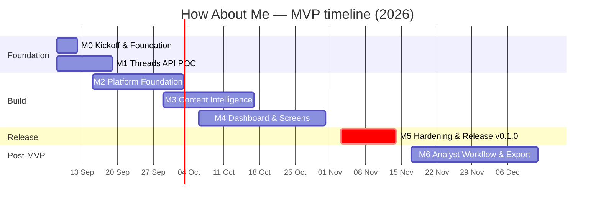

# 01 · Milestones & Timeline (MVP)

| Field    | Value                                                                                                                                         |
| -------- | --------------------------------------------------------------------------------------------------------------------------------------------- |
| Status   | Proposed baseline — dates assume kickoff **Mon 2026-09-08** and the team in [03-team-raci.md](03-team-raci.md); re-baseline after M1 POC exit |
| Source   | [00-source/04_OPERATIONS_COSTS_ROADMAP.md](../00-source/04_OPERATIONS_COSTS_ROADMAP.md) §4–§6 (Phases 0–5)                                    |
| Tracking | GitHub Milestones `M0`…`M6` on `mryesss97/how-about-me`; issues from [backlog.json](backlog.json)                                             |

## 1. Summary

| Milestone | Name                                                                                                | Source phase | Window                    | Due            | Gate (exit criteria)                                                            |
| --------- | --------------------------------------------------------------------------------------------------- | ------------ | ------------------------- | -------------- | ------------------------------------------------------------------------------- |
| **M0**    | Kickoff & Engineering Foundation                                                                    | —            | W1 · Sep 08 – Sep 12      | 2026-09-12     | Repo, CI, envs, conventions ready; team can run the stack locally               |
| **M1**    | Threads API POC                                                                                     | Phase 0      | W1–W2 · Sep 08 – Sep 19   | 2026-09-19     | POC report accepted; ingestion requirements frozen                              |
| **M2**    | Platform Foundation (Auth/RBAC · Projects · Integration · Queries · Collector · Sync jobs · Status) | Phase 1      | W2–W4 · Sep 15 – Oct 03   | 2026-10-03     | Scheduled sync runs safely ≥ 3 days on staging, no duplicates, failures visible |
| **M3**    | Content Intelligence Pipeline                                                                       | Phase 2      | W4–W6 · Sep 29 – Oct 17   | 2026-10-17     | Eval set tested; prompt/taxonomy/policy v1 frozen; versioning & retries proven  |
| **M4**    | Dashboard, Mentions Explorer & Screens                                                              | Phase 3      | W5–W8 · Oct 06 – Oct 31   | 2026-10-31     | All P0 screens; every KPI drill-down reconciles; analytics QA checklist green   |
| **M5**    | MVP Hardening & Release `v0.1.0`                                                                    | Phase 3 exit | W9–W10 · Nov 03 – Nov 14  | **2026-11-14** | Security/observability/release checklists done; UAT sign-off; production live   |
| **M6**    | Analyst Workflow & Export (P1)                                                                      | Phase 4      | W11–W14 · Nov 17 – Dec 12 | 2026-12-12     | Overrides, review queue, bulk re-analysis, backfill UI, CSV, P1 charts          |
| M7+       | Intelligence (P2)                                                                                   | Phase 5      | 2027 Q1                   | —              | spike detection, alerts, saved views, X                                         |

Overlaps are intentional: BE starts M2 foundation while the lead finishes the POC; FE builds the shell/screens with fake providers before real data arrives.

## 2. Gantt

## 3. Milestone detail

### M0 · Kickoff & Engineering Foundation (Sep 08 – Sep 12)

Deliverables: monorepo scaffold (done in this repo), CI, branch protection, issue/PR templates, Docker Postgres, Prisma baseline migration + seed, Untitled UI base, contracts/taxonomy packages, staging Supabase project, secrets inventory, kickoff meeting, backlog refined for M1–M2.
Exit: `pnpm dev` runs web+api locally with fake providers; CI green on `develop`; every engineer has run the stack.
Owner: Tech Lead. Inputs needed: Supabase staging project, hosting decision.

### M1 · Threads API POC (Sep 08 – Sep 19)

Deliverables per [../05-operations/01-poc-threads-api.md](../05-operations/01-poc-threads-api.md): Meta app + token, NestJS Threads client spike, search/pagination/since-until/TOP tests for the 4 seed terms, rate-limit/error notes, reply-access findings, recorded fixtures, POC report.
Exit: all exit criteria ticked or waived by the owner; provider adapter parameters updated in doc 06.
Owner: Tech Lead. Inputs needed: Meta developer account & App Review path.

### M2 · Platform Foundation (Sep 15 – Oct 03)

Epics: E01, E02, E03, E04, E05, E09 (status API + health), E13 (envs). FE: login, shell, listening queries screen, system status v1, settings (project/members/integrations).
Exit: staging runs scheduler with real Threads token for ≥ 3 consecutive days; 0 duplicate posts; failed jobs visible; RBAC tests green.
Owner: BE lead for pipeline, FE for screens. QC: TC-AUTH, TC-PROJ, TC-INT, TC-LQ, TC-COL executed.

### M3 · Content Intelligence (Sep 29 – Oct 17)

Epic E06 + eval dataset (QC + BA). Deliverables: state machine/worker, providers, schema, policy v1, versioning, retries, cost tracking, re-analyze endpoint, eval script & report.
Exit: eval targets in doc 08 §11 met or explicitly waived; prompt `classifier-v1`, `taxonomy-v1`, `safety-policy-v1` frozen; System Status shows analyzer health.
Owner: Tech Lead/BE. QC: TC-ANA + AI evaluation.

### M4 · Dashboard, Mentions Explorer & Screens (Oct 06 – Oct 31)

Epics E07, E08, E10 (P0 parts), E09 UI. Deliverables: analytics endpoints, overview page (6 KPI + 6 charts + compare + drill-down), mentions list/detail, banners/states, settings completion.
Exit: analytics QA checklist green on staging dataset; every drill-down reconciles; NFR-001…004 measured.
Owner: FE lead + BE for analytics. QC: TC-DASH, TC-MEN, TC-SYS.

### M5 · Hardening & Release (Nov 03 – Nov 14)

Deliverables: perf pass (indexes, query plans), security checklist, observability checklist, alerts, runbook, UAT with stakeholders, production deploy, `v0.1.0` tag, release notes, MVP retrospective.
Exit: [06-release-plan-checklist.md](06-release-plan-checklist.md) fully ticked; owner sign-off.
Owner: Tech Lead + PM. QC: regression + UAT support.

### M6 · Analyst Workflow & Export (Nov 17 – Dec 12)

Epics E11, E12, remaining P1 analytics (language, topic × sentiment, negative contributors, query share), analysis settings, aggregates if needed.
Exit: P1 stories accepted; overrides affect analytics; export within caps.

## 4. Cadence & ceremonies

- Sprint length 1 week (Mon–Fri) aligned to milestones; planning Monday 30 min, review/demo Friday 30 min, retro bi-weekly.
- Daily async standup in the team channel; blockers escalated to owner same day.
- Milestone review with owner at each due date; go/no-go for the next milestone.

## 5. Critical path & buffers

`M1 POC → M2 collector on real data → M3 eval freeze → M4 reconciliation → M5 release`. Built-in buffer: ~1 week inside M4/M5. If M1 slips > 1 week, M2–M5 shift 1:1; FE work continues on fake providers to absorb slack.

## 6. Change control

Scope changes go through the owner; any P1 item pulled into M2–M5 must displace an equal-size item or extend M5. This document is the baseline; deviations are logged in the milestone review notes (`docs/03-delivery/reviews/` to be created at first review).
