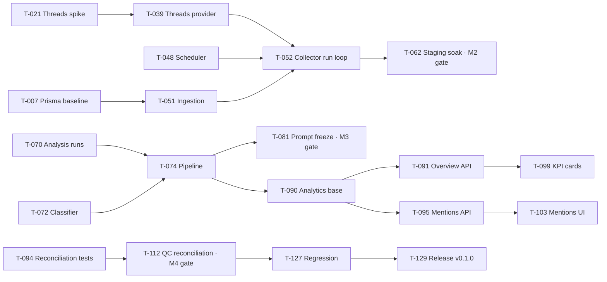

# 02 · Work Breakdown Structure (WBS) → GitHub Issues

> **Generated** from [backlog.json](backlog.json) by `pnpm backlog:render`. Edit the JSON, not this file.
> Each task `T-###` is one GitHub issue (`pnpm issues:sync`). Estimates: S ≤ 1 d · M ≤ 3 d · L ≤ 5 d.

## Summary

| Milestone                                                      | Tasks | Engineer | QC  | S / M / L   |
| -------------------------------------------------------------- | ----- | -------- | --- | ----------- |
| **M0** Kickoff & Engineering Foundation (due 2026-09-12)       | 17    | 16       | 1   | 9 / 7 / 1   |
| **M1** Threads API POC (due 2026-09-19)                        | 8     | 7        | 1   | 5 / 3 / 0   |
| **M2** Platform Foundation (due 2026-10-03)                    | 37    | 32       | 5   | 16 / 16 / 5 |
| **M3** Content Intelligence Pipeline (due 2026-10-17)          | 14    | 11       | 3   | 3 / 7 / 4   |
| **M4** Dashboard, Mentions Explorer & Screens (due 2026-10-31) | 23    | 19       | 4   | 4 / 13 / 6  |
| **M5** MVP Hardening & Release v0.1.0 (due 2026-11-14)         | 11    | 9        | 2   | 4 / 6 / 1   |
| **M6** Analyst Workflow & Export (P1) (due 2026-12-12)         | 16    | 14       | 2   | 5 / 8 / 3   |
| **Total**                                                      | 126   | 108      | 18  |             |

## Open inputs (Product Owner)

| ID   | Needed by       | Item                                                                                                                   | Blocks       |
| ---- | --------------- | ---------------------------------------------------------------------------------------------------------------------- | ------------ |
| IN-1 | M1 (2026-09-08) | Meta developer account access, Threads app creation, App Review path; long-lived token                                 | T-020        |
| IN-2 | M0 (2026-09-12) | Supabase projects for staging (and production by M5): URL, anon key, DB URLs, JWT settings                             | T-004, T-123 |
| IN-3 | M3 (2026-09-29) | Classifier provider/model decision + OpenAI API key (default assumption: OpenAI structured outputs with a small model) | T-072        |
| IN-4 | M0 (2026-09-12) | Hosting decision for API/worker (Railway/Fly/Render/VM) and web (Vercel)                                               | T-005, T-006 |
| IN-5 | M0              | Team roster & GitHub handles for CODEOWNERS and assignments                                                            | T-002        |
| IN-6 | M4              | Untitled UI PRO licence only if a needed component is PRO-only                                                         | —            |
| IN-7 | M2              | QA test accounts (admin/analyst/viewer emails) on staging Supabase Auth                                                | T-017        |

## M0 · Kickoff & Engineering Foundation — due 2026-09-12

Repo, CI, envs, conventions ready; team can run the stack locally with fake providers.

| ID    | Issue | Task                                                                                                                 | Type  | Role     | Area         | Pri | Est | Epic | Depends on | Stories / FRs                                    | Docs                                                                                                                                                                                                                                                                          |
| ----- | ----- | -------------------------------------------------------------------------------------------------------------------- | ----- | -------- | ------------ | --- | --- | ---- | ---------- | ------------------------------------------------ | ----------------------------------------------------------------------------------------------------------------------------------------------------------------------------------------------------------------------------------------------------------------------------- |
| T-001 | —     | Verify monorepo scaffold & local run on every dev machine                                                            | chore | engineer | infra        | P0  | S   | E13  | —          | US-180, NFR-060                                  | [01-local-setup.md](../06-engineering/01-local-setup.md) [02-monorepo-structure.md](../06-engineering/02-monorepo-structure.md)                                                                                                                                            |
| T-002 | —     | GitHub branch protection, CODEOWNERS and repo settings                                                               | chore | engineer | infra        | P0  | S   | E13  | —          | US-181, NFR-061, NFR-066                         | [04-git-workflow.md](../06-engineering/04-git-workflow.md#6-branch-protection-to-apply-on-github--admin)                                                                                                                                                                      |
| T-003 | —     | CI hardening: Postgres service, coverage, FE secret scan, gitleaks                                                   | chore | engineer | infra        | P0  | M   | E13  | —          | US-181, US-187, NFR-061, NFR-010, NFR-019        | [07-ci-cd.md](../06-engineering/07-ci-cd.md) [08-security-secrets.md](../02-architecture/08-security-secrets.md#9-ci-security-gates)                                                                                                                                       |
| T-004 | —     | Create Supabase staging project & configure Auth                                                                     | chore | engineer | infra        | P0  | S   | E13  | —          | US-182, NFR-062                                  | [11-environments-deployment.md](../02-architecture/11-environments-deployment.md#3-supabase-setup-per-environment)                                                                                                                                                            |
| T-005 | —     | Hosting decision & staging deploy pipeline for API/worker                                                            | chore | engineer | infra, api   | P0  | M   | E13  | T-004      | US-189, NFR-062                                  | [11-environments-deployment.md](../02-architecture/11-environments-deployment.md#2-hosting-assumptions-owner-to-confirm) [07-ci-cd.md](../06-engineering/07-ci-cd.md)                                                                                                      |
| T-006 | —     | Web staging deploy (Vercel) with env configuration                                                                   | chore | engineer | infra, web   | P0  | S   | E13  | T-004      | US-189, NFR-062, NFR-010                         | [11-environments-deployment.md](../02-architecture/11-environments-deployment.md) [06-environment-variables.md](../06-engineering/06-environment-variables.md#appsweb)                                                                                                     |
| T-007 | —     | Verify & finalise Prisma baseline migration (init + init_extras) against Postgres                                    | chore | engineer | db, api      | P0  | L   | E13  | —          | US-183, NFR-063                                  | [04-data-model.md](../02-architecture/04-data-model.md)                                                                                                                                                                                                                       |
| T-008 | —     | Idempotent seed: project, admin membership, 4 queries, integration placeholder                                       | chore | engineer | db, api      | P0  | S   | E13  | T-007      | US-006, US-010, US-030, FR-019, FR-030, FR-050   | [04-data-model.md](../02-architecture/04-data-model.md#6-prisma-mapping-notes) [03-user-stories.md](../01-product/03-user-stories.md#us-030-seed-default-queries-p0)                                                                                                       |
| T-009 | —     | Contracts package: enums, error codes, common schemas, resource DTOs skeleton                                        | chore | engineer | contracts    | P0  | M   | E13  | —          | US-184, NFR-064                                  | [05-api-contract.md](../02-architecture/05-api-contract.md) [03-coding-conventions.md](../06-engineering/03-coding-conventions.md#4-contracts-packagescontracts)                                                                                                           |
| T-010 | —     | Taxonomy package v1: labels, guides, safety policy v1, versions                                                      | chore | engineer | taxonomy, ai | P0  | S   | E13  | —          | US-077, FR-105, FR-107, FR-108                   | [08-taxonomy-classification.md](../01-product/08-taxonomy-classification.md)                                                                                                                                                                                                  |
| T-011 | —     | Untitled UI foundation: theme, app shell, semantic badges, state components                                          | chore | engineer | web          | P0  | M   | E13  | —          | US-185, NFR-030, NFR-035                         | [09-ux-specification.md](../01-product/09-ux-specification.md#2-global-patterns) [03-frontend-design.md](../02-architecture/03-frontend-design.md#6-components-mapping-untitled-ui)                                                                                        |
| T-012 | —     | NestJS foundation: config schema, pino logging with redaction, request-id, error envelope, Zod pipe, Swagger, health | chore | engineer | api          | P0  | M   | E13  | —          | US-132, US-133, FR-172, FR-173, NFR-014, NFR-015 | [02-backend-design.md](../02-architecture/02-backend-design.md#4-request-lifecycle) [02-backend-design.md](../02-architecture/02-backend-design.md#5-error-model) [09-observability.md](../02-architecture/09-observability.md#1-logging)                               |
| T-013 | —     | Fake providers (Threads fixtures, Safety, Classifier) and PROVIDERS_MODE wiring                                      | chore | engineer | api, ai      | P0  | M   | E13  | —          | US-078, US-186, FR-112, FR-047                   | [02-backend-design.md](../02-architecture/02-backend-design.md#10-testing-hooks) [06-ingestion-pipeline.md](../02-architecture/06-ingestion-pipeline.md#2-provider-adapter) [07-analysis-pipeline.md](../02-architecture/07-analysis-pipeline.md#3-provider-interfaces) |
| T-014 | —     | API test infrastructure: Jest integration with Docker Postgres, Supertest, JWT test helper                           | chore | engineer | api, infra   | P0  | M   | E13  | T-007      | US-186, NFR-065                                  | [10-testing-strategy.md](../02-architecture/10-testing-strategy.md)                                                                                                                                                                                                           |
| T-015 | —     | Web test infrastructure: Vitest + Testing Library + Playwright skeleton                                              | chore | engineer | web, infra   | P0  | S   | E13  | —          | US-186, NFR-065                                  | [10-testing-strategy.md](../02-architecture/10-testing-strategy.md#4-e2e-smoke-playwright) [03-frontend-design.md](../02-architecture/03-frontend-design.md#10-testing)                                                                                                    |
| T-016 | —     | Kickoff, backlog refinement for M1–M2, sprint 1 plan                                                                 | docs  | engineer | docs         | P0  | S   | E13  | —          | US-190, NFR-074                                  | [01-milestones-timeline.md](../03-delivery/01-milestones-timeline.md) [05-definition-of-ready-done.md](../03-delivery/05-definition-of-ready-done.md)                                                                                                                      |
| T-017 | —     | QC environment readiness: staging access, role accounts, fixture scenarios list                                      | qc    | qc       | qa           | P0  | S   | E13  | T-004      | US-186, NFR-065                                  | [01-test-plan.md](../04-qa/01-test-plan.md#4-environments--data)                                                                                                                                                                                                              |

## M1 · Threads API POC — due 2026-09-19

POC report accepted; ingestion requirements frozen. Gate for M2 real-data ingestion.

| ID    | Issue | Task                                                                                 | Type  | Role     | Area       | Pri | Est | Epic | Depends on                 | Stories / FRs                  | Docs                                                                                                                                                                                                                       |
| ----- | ----- | ------------------------------------------------------------------------------------ | ----- | -------- | ---------- | --- | --- | ---- | -------------------------- | ------------------------------ | -------------------------------------------------------------------------------------------------------------------------------------------------------------------------------------------------------------------------- |
| T-020 | —     | POC: Meta app setup, scopes and long-lived token acquisition                         | spike | engineer | api, infra | P0  | M   | E03  | —                          | US-026, FR-048                 | [01-poc-threads-api.md](../05-operations/01-poc-threads-api.md#2-setup-checklist-meta)                                                                                                                                     |
| T-021 | —     | POC: Threads client spike (search, pagination, field selection) in NestJS            | spike | engineer | api        | P0  | M   | E03  | T-020                      | US-025, US-026, FR-047, FR-048 | [06-ingestion-pipeline.md](../02-architecture/06-ingestion-pipeline.md#2-provider-adapter) [01-poc-threads-api.md](../05-operations/01-poc-threads-api.md#3-search-tests-record-request-response-sample-latency-counts) |
| T-022 | —     | POC: run search tests S1–S12 and measure lag, duplicates, depth                      | spike | engineer | api        | P0  | M   | E03  | T-021                      | US-026, FR-048                 | [01-poc-threads-api.md](../05-operations/01-poc-threads-api.md#3-search-tests-record-request-response-sample-latency-counts)                                                                                               |
| T-023 | —     | POC: rate-limit and error behaviour capture (headers, 400/401/403/429/5xx)           | spike | engineer | api        | P0  | S   | E03  | T-021                      | US-026, US-059, FR-082, FR-089 | [06-ingestion-pipeline.md](../02-architecture/06-ingestion-pipeline.md#7-retry-backoff-circuit-fr-083-fr-084)                                                                                                              |
| T-024 | —     | POC: reply access tests and third-party limitation write-up                          | spike | engineer | api, docs  | P0  | S   | E03  | T-021                      | US-026, FR-048                 | [01-poc-threads-api.md](../05-operations/01-poc-threads-api.md#4-reply-access-tests)                                                                                                                                       |
| T-025 | —     | POC: record and sanitise ≥20 fixtures for FakeThreadsProvider and contract tests     | spike | engineer | api        | P0  | S   | E03  | T-022, T-023               | US-025, FR-047                 | [10-testing-strategy.md](../02-architecture/10-testing-strategy.md#5-fixtures)                                                                                                                                             |
| T-026 | —     | POC report, parameter recommendations and M1 exit review                             | docs  | engineer | docs       | P0  | S   | E03  | T-022, T-023, T-024, T-025 | US-026, FR-048                 | [01-poc-threads-api.md](../05-operations/01-poc-threads-api.md#5-report-fill-in) [06-ingestion-pipeline.md](../02-architecture/06-ingestion-pipeline.md#10-configuration)                                               |
| T-027 | —     | QC: review POC data-quality sample (100 posts per term) and seed eval-set candidates | qc    | qc       | qa, ai     | P0  | S   | E03  | T-022                      | US-084, FR-118                 | [01-poc-threads-api.md](../05-operations/01-poc-threads-api.md#53-data-quality-sample-of-100-posts-per-term) [03-ai-evaluation-plan.md](../04-qa/03-ai-evaluation-plan.md#1-dataset-docs04-qadatasetseval-v1jsonl)      |

## M2 · Platform Foundation — due 2026-10-03

Auth/RBAC, projects, Threads integration, listening queries, collector, sync jobs, status. Exit: scheduled sync runs safely >= 3 days on staging, no duplicates, failures visible.

| ID    | Issue | Task                                                                                                               | Type    | Role     | Area           | Pri | Est | Epic | Depends on                        | Stories / FRs                                                                                  | Docs                                                                                                                                                                                                                           |
| ----- | ----- | ------------------------------------------------------------------------------------------------------------------ | ------- | -------- | -------------- | --- | --- | ---- | --------------------------------- | ---------------------------------------------------------------------------------------------- | ------------------------------------------------------------------------------------------------------------------------------------------------------------------------------------------------------------------------------ |
| T-030 | —     | Auth: Supabase JWT guard (JWKS/HS256), /me endpoint, profile upsert                                                | feature | engineer | api            | P0  | M   | E01  | T-012, T-007                      | US-001, US-004, FR-010, FR-013, FR-017                                                         | [08-security-secrets.md](../02-architecture/08-security-secrets.md#2-authentication-jwt) [05-api-contract.md](../02-architecture/05-api-contract.md#2-auth--user)                                                           |
| T-031 | —     | RBAC: ProjectRoleGuard, @Roles, project setting gates, role-matrix tests                                           | feature | engineer | api            | P0  | M   | E01  | T-030                             | US-003, FR-014, FR-015, FR-016                                                                 | [02-personas-rbac.md](../01-product/02-personas-rbac.md#3-permission-matrix-server-enforced) [08-security-secrets.md](../02-architecture/08-security-secrets.md#3-authorization-rbac)                                       |
| T-032 | —     | Web auth: login page, Supabase client, session refresh, API client with bearer & 401 handling, sign out            | feature | engineer | web            | P0  | M   | E01  | T-011, T-030                      | US-001, US-007, FR-010, FR-011                                                                 | [03-frontend-design.md](../02-architecture/03-frontend-design.md#3-authentication-in-fe) [09-ux-specification.md](../01-product/09-ux-specification.md#31-login-login)                                                      |
| T-033 | —     | Web: role-aware navigation, RequireRole, forbidden state                                                           | feature | engineer | web            | P0  | S   | E01  | T-032                             | US-005, US-008, FR-018                                                                         | [09-ux-specification.md](../01-product/09-ux-specification.md#23-states-every-data-widget)                                                                                                                                     |
| T-034 | —     | Projects module: list/get/patch with timezone validation, settings, audit                                          | feature | engineer | api            | P0  | S   | E02  | T-031, T-059                      | US-011, US-012, US-143, FR-031, FR-032, FR-200                                                 | [05-api-contract.md](../02-architecture/05-api-contract.md#3-projects--members)                                                                                                                                                |
| T-035 | —     | Members module: add/change/remove, last-admin rule, lazy profile, optional Supabase invite                         | feature | engineer | api            | P0  | M   | E02  | T-034                             | US-013, FR-033, FR-034, FR-035                                                                 | [04-data-model.md](../02-architecture/04-data-model.md#43-project_members) [05-api-contract.md](../02-architecture/05-api-contract.md#3-projects--members)                                                                  |
| T-036 | —     | Web: Settings → Project and Members screens                                                                        | feature | engineer | web            | P0  | M   | E02  | T-033, T-034, T-035               | US-012, US-013, US-140, FR-032, FR-033, FR-034                                                 | [09-ux-specification.md](../01-product/09-ux-specification.md#37-settings-settings--p0)                                                                                                                                        |
| T-037 | —     | Crypto service: AES-256-GCM token encryption with key ids and rewrap CLI                                           | feature | engineer | api            | P0  | S   | E03  | T-012                             | US-020, FR-040, NFR-013                                                                        | [08-security-secrets.md](../02-architecture/08-security-secrets.md#4-secrets-inventory) [0012-encrypted-provider-tokens.md](../02-architecture/adr/0012-encrypted-provider-tokens.md)                                       |
| T-038 | —     | Integrations module: Threads status, PUT token, verify, disconnect, secrets table, audit                           | feature | engineer | api            | P0  | M   | E03  | T-037, T-031, T-039               | US-020, US-021, US-022, FR-040, FR-041, FR-042, FR-043, FR-044                                 | [05-api-contract.md](../02-architecture/05-api-contract.md#4-integrations-threads)                                                                                                                                             |
| T-039 | —     | ThreadsDiscoveryProvider (real): search, pagination, field selection, error mapping, rate-limit metadata, timeouts | feature | engineer | api            | P0  | L   | E03  | T-021, T-025                      | US-025, US-059, FR-047, FR-082, FR-089                                                         | [06-ingestion-pipeline.md](../02-architecture/06-ingestion-pipeline.md#2-provider-adapter)                                                                                                                                     |
| T-040 | —     | Integration status transitions on 401/403, scheduler pause and token refresh job                                   | feature | engineer | api            | P0  | M   | E03  | T-038, T-052                      | US-023, US-024, FR-045, FR-046, FR-085                                                         | [06-ingestion-pipeline.md](../02-architecture/06-ingestion-pipeline.md#7-retry-backoff-circuit-fr-083-fr-084) [02-runbook.md](../05-operations/02-runbook.md#1-threads-connection-expired--permission-error)                |
| T-041 | —     | Web: Settings → Integrations (Threads card, update token, verify, read-only for non-admin)                         | feature | engineer | web            | P0  | M   | E03  | T-036, T-038                      | US-020, US-021, US-022, US-141, FR-043, FR-044                                                 | [09-ux-specification.md](../01-product/09-ux-specification.md#37-settings-settings--p0)                                                                                                                                        |
| T-042 | —     | Listening queries CRUD: validation, duplicates, immutables, soft delete/restore, enable/disable scheduling, audit  | feature | engineer | api, contracts | P0  | L   | E04  | T-031, T-059, T-009               | US-031, US-032, US-033, US-034, US-035, FR-051, FR-052, FR-053, FR-054, FR-055, FR-056, FR-057 | [05-api-contract.md](../02-architecture/05-api-contract.md#5-listening-queries) [06-business-rules-glossary.md](../01-product/06-business-rules-glossary.md#listening-queries)                                              |
| T-043 | —     | Run-now endpoint with SYNC_ALREADY_RUNNING and throttling                                                          | feature | engineer | api            | P0  | S   | E04  | T-042, T-055                      | US-036, FR-058, NFR-017                                                                        | [05-api-contract.md](../02-architecture/05-api-contract.md#5-listening-queries)                                                                                                                                                |
| T-044 | —     | Term matcher utility (exclude/include, NFC, case-insensitive) with tests                                           | feature | engineer | api            | P0  | S   | E04  | —                                 | US-037, US-038, FR-059, FR-060                                                                 | [06-business-rules-glossary.md](../01-product/06-business-rules-glossary.md#listening-queries) [06-ingestion-pipeline.md](../02-architecture/06-ingestion-pipeline.md#6-ingestion--deduplication-fr-074fr-079-fr-088)       |
| T-045 | —     | Query list sync summary: last job, last error, matched post counts (all-time/24h)                                  | feature | engineer | api            | P0  | S   | E04  | T-042, T-052                      | US-039, FR-061                                                                                 | [05-api-contract.md](../02-architecture/05-api-contract.md#get-projectsprojectidlistening-queries)                                                                                                                             |
| T-046 | —     | Web: Listening Queries table screen                                                                                | feature | engineer | web            | P0  | M   | E04  | T-011, T-033, T-042, T-045        | US-031, US-039, US-040, FR-051, FR-061, FR-062                                                 | [09-ux-specification.md](../01-product/09-ux-specification.md#35-listening-queries-listening-queries--p0)                                                                                                                      |
| T-047 | —     | Web: Create/Edit query drawer and actions (run now, enable/disable, delete/restore)                                | feature | engineer | web            | P0  | M   | E04  | T-046, T-043                      | US-032, US-033, US-034, US-035, US-036, FR-052, FR-053, FR-054, FR-058                         | [09-ux-specification.md](../01-product/09-ux-specification.md#35-listening-queries-listening-queries--p0)                                                                                                                      |
| T-048 | —     | Scheduler tick with DB claiming (FOR UPDATE SKIP LOCKED), next_run_at/backoff, stale locks                         | feature | engineer | api            | P0  | M   | E05  | T-012, T-007                      | US-050, US-062, FR-070, FR-071, FR-086                                                         | [06-ingestion-pipeline.md](../02-architecture/06-ingestion-pipeline.md#3-scheduling) [02-backend-design.md](../02-architecture/02-backend-design.md#6-scheduling--workers)                                                  |
| T-049 | —     | WindowCalculator with edge-case tests                                                                              | feature | engineer | api            | P0  | S   | E05  | —                                 | US-051, FR-072                                                                                 | [06-ingestion-pipeline.md](../02-architecture/06-ingestion-pipeline.md#4-window-calculation-fr-072)                                                                                                                            |
| T-050 | —     | PostNormalizer: provider item → NormalizedPost, validation counters, content hash                                  | feature | engineer | api            | P0  | S   | E05  | T-025                             | US-053, FR-074, FR-075, FR-079                                                                 | [06-ingestion-pipeline.md](../02-architecture/06-ingestion-pipeline.md#6-ingestion--deduplication-fr-074fr-079-fr-088)                                                                                                         |
| T-051 | —     | IngestionService: upsert/dedupe/matches/change detection/excluded flag/enqueue analysis (page transaction)         | feature | engineer | api, db        | P0  | L   | E05  | T-050, T-044, T-007               | US-054, US-055, US-037, FR-076, FR-077, FR-078, FR-088, FR-059                                 | [06-ingestion-pipeline.md](../02-architecture/06-ingestion-pipeline.md#6-ingestion--deduplication-fr-074fr-079-fr-088) [06-business-rules-glossary.md](../01-product/06-business-rules-glossary.md#identity--deduplication) |
| T-052 | —     | CollectorService run loop: pagination, page cap, partial, last_cursor, counters, rate-limit recording              | feature | engineer | api            | P0  | L   | E05  | T-048, T-049, T-051, T-039, T-053 | US-052, US-057, US-063, FR-073, FR-080, FR-087, FR-089                                         | [06-ingestion-pipeline.md](../02-architecture/06-ingestion-pipeline.md#5-run-algorithm)                                                                                                                                        |
| T-053 | —     | Retry policy: exponential backoff with jitter, Retry-After, error-class rules                                      | feature | engineer | api            | P0  | S   | E05  | —                                 | US-060, FR-083                                                                                 | [06-ingestion-pipeline.md](../02-architecture/06-ingestion-pipeline.md#7-retry-backoff-circuit-fr-083-fr-084)                                                                                                                  |
| T-054 | —     | Circuit breaker with DB-persisted state and status exposure                                                        | feature | engineer | api, db        | P0  | S   | E05  | T-052                             | US-061, FR-084                                                                                 | [06-ingestion-pipeline.md](../02-architecture/06-ingestion-pipeline.md#7-retry-backoff-circuit-fr-083-fr-084)                                                                                                                  |
| T-055 | —     | Sync jobs module: list/detail/retry (resume from cursor)                                                           | feature | engineer | api            | P0  | M   | E05  | T-052                             | US-058, FR-081, FR-175                                                                         | [05-api-contract.md](../02-architecture/05-api-contract.md#8-sync-jobs)                                                                                                                                                        |
| T-057 | —     | System status endpoint v1 (threads, collector, database; analysis stub)                                            | feature | engineer | api            | P0  | M   | E09  | T-038, T-052, T-054               | US-131, US-136, FR-171, FR-176                                                                 | [05-api-contract.md](../02-architecture/05-api-contract.md#10-system-status) [09-observability.md](../02-architecture/09-observability.md#4-system-status-semantics-fr-176)                                                 |
| T-058 | —     | Metrics endpoint (prom-client) with core collector/API metrics                                                     | feature | engineer | api            | P0  | S   | E09  | T-012, T-052                      | US-134, FR-174                                                                                 | [09-observability.md](../02-architecture/09-observability.md#2-metrics-prometheus-text-at-get-metrics-protected-by-metrics_token-header-or-periodic-metrics-log-line-when-scraping-is-unavailable)                             |
| T-059 | —     | Audit module: record helper and admin list endpoint                                                                | feature | engineer | api            | P0  | S   | E09  | T-031                             | US-137, FR-200, FR-201                                                                         | [08-security-secrets.md](../02-architecture/08-security-secrets.md#6-audit-log) [05-api-contract.md](../02-architecture/05-api-contract.md#11-audit)                                                                        |
| T-060 | —     | Web: System Status screen v1 (overview cards + sync jobs tab + job detail drawer)                                  | feature | engineer | web            | P0  | M   | E09  | T-011, T-057, T-055               | US-130, US-058, US-135, FR-170, FR-081, FR-175                                                 | [09-ux-specification.md](../01-product/09-ux-specification.md#36-system-status-system-status--p0)                                                                                                                              |
| T-061 | —     | Web: Audit log tab (admin)                                                                                         | feature | engineer | web            | P0  | S   | E09  | T-060, T-059                      | US-137, FR-201                                                                                 | [09-ux-specification.md](../01-product/09-ux-specification.md#36-system-status-system-status--p0)                                                                                                                              |
| T-062 | —     | Staging soak: run scheduler ≥3 days with real token; review duplicates/failures (M2 gate)                          | chore   | engineer | infra, api     | P0  | S   | E05  | T-005, T-040, T-052, T-057        | US-050, NFR-021, NFR-022                                                                       | [01-milestones-timeline.md](../03-delivery/01-milestones-timeline.md#m2--platform-foundation-sep-15--oct-03)                                                                                                                   |
| T-063 | —     | QC: TC-AUTH test cases execution (authentication & RBAC)                                                           | qc      | qc       | qa             | P0  | M   | E01  | T-030, T-031, T-032, T-033        | US-001, US-003, FR-010, FR-015                                                                 | [TC-AUTH-authentication-rbac.md](../04-qa/test-cases/TC-AUTH-authentication-rbac.md)                                                                                                                                           |
| T-064 | —     | QC: TC-PROJ execution (project & members)                                                                          | qc      | qc       | qa             | P0  | S   | E02  | T-034, T-035, T-036               | US-010, US-013, FR-030, FR-035                                                                 | [TC-PROJ-project-members.md](../04-qa/test-cases/TC-PROJ-project-members.md)                                                                                                                                                   |
| T-065 | —     | QC: TC-INT execution (Threads integration & secrets)                                                               | qc      | qc       | qa             | P0  | S   | E03  | T-038, T-040, T-041               | US-020, US-023, FR-041, FR-045                                                                 | [TC-INT-threads-integration.md](../04-qa/test-cases/TC-INT-threads-integration.md)                                                                                                                                             |
| T-066 | —     | QC: TC-LQ execution (listening queries)                                                                            | qc      | qc       | qa             | P0  | M   | E04  | T-042, T-043, T-046, T-047        | US-032, US-037, FR-052, FR-059                                                                 | [TC-LQ-listening-queries.md](../04-qa/test-cases/TC-LQ-listening-queries.md)                                                                                                                                                   |
| T-067 | —     | QC: TC-COL execution (collector, dedupe, retry, partial, circuit) with fake and real providers                     | qc      | qc       | qa             | P0  | L   | E05  | T-052, T-053, T-054, T-055, T-062 | US-054, US-060, US-063, FR-076, FR-083, FR-087                                                 | [TC-COL-collector-sync.md](../04-qa/test-cases/TC-COL-collector-sync.md)                                                                                                                                                       |

## M3 · Content Intelligence Pipeline — due 2026-10-17

Relevance, safety, sentiment, intent, topic, language, summary; versioning; retries; eval dataset tested; prompt/taxonomy/policy v1 frozen.

| ID    | Issue | Task                                                                                                              | Type    | Role     | Area          | Pri | Est | Epic | Depends on                 | Stories / FRs                                                                  | Docs                                                                                                                                                                                                              |
| ----- | ----- | ----------------------------------------------------------------------------------------------------------------- | ------- | -------- | ------------- | --- | --- | ---- | -------------------------- | ------------------------------------------------------------------------------ | ----------------------------------------------------------------------------------------------------------------------------------------------------------------------------------------------------------------- |
| T-070 | —     | Analysis runs: state machine, enqueue with version dedupe, batch claiming worker, watchdog                        | feature | engineer | api, db       | P0  | L   | E06  | T-007, T-012, T-010        | US-070, US-082, FR-100, FR-101, FR-116                                         | [07-analysis-pipeline.md](../02-architecture/07-analysis-pipeline.md#1-state-machine) [07-analysis-pipeline.md](../02-architecture/07-analysis-pipeline.md#7-versioning--dedupe-br-023-br-024)                 |
| T-071 | —     | SafetyProvider: OpenAI moderation adapter + policy mapping wiring                                                 | feature | engineer | api, ai       | P0  | M   | E06  | T-010, T-013               | US-073, FR-104, FR-105                                                         | [07-analysis-pipeline.md](../02-architecture/07-analysis-pipeline.md#6-safety-policy-mapping) [08-taxonomy-classification.md](../01-product/08-taxonomy-classification.md#9-safety-policy-v1-safety-policy-v1) |
| T-072 | —     | ContentClassifier: OpenAI structured-output adapter, prompt v1 file, usage & cost                                 | feature | engineer | api, ai       | P0  | L   | E06  | T-073, T-013               | US-074, US-078, US-083, FR-106, FR-107, FR-108, FR-109, FR-110, FR-112, FR-117 | [07-analysis-pipeline.md](../02-architecture/07-analysis-pipeline.md#3-provider-interfaces) [07-analysis-pipeline.md](../02-architecture/07-analysis-pipeline.md#5-prompt-v1-classifier-v1--outline)           |
| T-073 | —     | Classifier output schema (Zod ↔ JSON schema) and post-validation rules                                            | feature | engineer | contracts, ai | P0  | S   | E06  | T-009, T-010               | US-074, FR-119                                                                 | [07-analysis-pipeline.md](../02-architecture/07-analysis-pipeline.md#4-classifier-output-json-schema-strict)                                                                                                      |
| T-074 | —     | Pipeline orchestration: relevance gate, two-step flag, persist analyses + labels, current_analysis_id transaction | feature | engineer | api, db       | P0  | L   | E06  | T-070, T-071, T-072        | US-071, US-072, US-075, US-076, US-077, US-080, FR-102, FR-103, FR-111, FR-114 | [07-analysis-pipeline.md](../02-architecture/07-analysis-pipeline.md#2-processing-order)                                                                                                                          |
| T-075 | —     | Analysis failure handling: retries, corrective schema retry, error codes, provider-auth pause, daily budget pause | feature | engineer | api           | P0  | M   | E06  | T-074                      | US-079, FR-113                                                                 | [07-analysis-pipeline.md](../02-architecture/07-analysis-pipeline.md#8-retries--failures-fr-113) [07-analysis-pipeline.md](../02-architecture/07-analysis-pipeline.md#9-cost-controls)                         |
| T-076 | —     | Re-analyze single mention endpoint (force) with audit and ANALYSIS_ALREADY_PENDING                                | feature | engineer | api           | P0  | S   | E06  | T-070, T-031               | US-081, FR-115                                                                 | [05-api-contract.md](../02-architecture/05-api-contract.md#7-mentions)                                                                                                                                            |
| T-077 | —     | Analysis ops endpoints (runs list, retry, retry-failed) and System Status analysis section                        | feature | engineer | api           | P0  | M   | E09  | T-075, T-057               | US-135, US-131, FR-175, FR-171, FR-176                                         | [05-api-contract.md](../02-architecture/05-api-contract.md#9-analysis-runs-ops) [09-observability.md](../02-architecture/09-observability.md#4-system-status-semantics-fr-176)                                 |
| T-078 | —     | Stale marking on content change and version change helper                                                         | feature | engineer | api           | P0  | S   | E06  | T-070, T-051               | US-055, US-077, FR-078, FR-100                                                 | [07-analysis-pipeline.md](../02-architecture/07-analysis-pipeline.md#7-versioning--dedupe-br-023-br-024)                                                                                                          |
| T-079 | —     | Evaluation script `eval:classifier` (JSONL → per-dimension metrics report)                                        | feature | engineer | api, ai       | P0  | M   | E06  | T-072, T-071               | US-084, FR-118                                                                 | [03-ai-evaluation-plan.md](../04-qa/03-ai-evaluation-plan.md#3-running) [07-analysis-pipeline.md](../02-architecture/07-analysis-pipeline.md#12-evaluation)                                                    |
| T-080 | —     | Build labelled evaluation dataset v1 (≥150 items, VI/EN, quotas, double labelling)                                | qc      | qc       | qa, ai        | P0  | L   | E06  | T-027                      | US-084, FR-118                                                                 | [03-ai-evaluation-plan.md](../04-qa/03-ai-evaluation-plan.md)                                                                                                                                                     |
| T-081 | —     | Prompt v1 tuning iterations against eval set; freeze classifier-v1 / taxonomy-v1 / safety-policy-v1               | spike   | engineer | ai, api       | P0  | M   | E06  | T-079, T-080               | US-084, FR-118                                                                 | [08-taxonomy-classification.md](../01-product/08-taxonomy-classification.md#11-evaluation-targets-v1-freeze-gate)                                                                                                 |
| T-082 | —     | QC: TC-ANA execution (analysis pipeline)                                                                          | qc      | qc       | qa            | P0  | M   | E06  | T-074, T-075, T-076, T-077 | US-070, US-074, FR-100, FR-113                                                 | [TC-ANA-analysis-pipeline.md](../04-qa/test-cases/TC-ANA-analysis-pipeline.md)                                                                                                                                    |
| T-083 | —     | QC: AI evaluation report review and safety threshold tuning proposal                                              | qc      | qc       | qa, ai        | P0  | M   | E06  | T-081                      | US-084, FR-118, FR-105                                                         | [03-ai-evaluation-plan.md](../04-qa/03-ai-evaluation-plan.md#4-acceptance) [08-taxonomy-classification.md](../01-product/08-taxonomy-classification.md#9-safety-policy-v1-safety-policy-v1)                    |

## M4 · Dashboard, Mentions Explorer & Screens — due 2026-10-31

All P0 screens; analytics endpoints; every KPI drill-down reconciles; analytics QA checklist green.

| ID    | Issue | Task                                                                                            | Type    | Role     | Area    | Pri | Est | Epic | Depends on                 | Stories / FRs                                                                                  | Docs                                                                                                                                                                                                |
| ----- | ----- | ----------------------------------------------------------------------------------------------- | ------- | -------- | ------- | --- | --- | ---- | -------------------------- | ---------------------------------------------------------------------------------------------- | --------------------------------------------------------------------------------------------------------------------------------------------------------------------------------------------------- |
| T-090 | —     | Analytics foundation: filter parsing, range/timezone utilities, previous-period math, base CTE  | feature | engineer | api     | P0  | M   | E07  | T-009, T-074               | US-090, US-091, US-100, FR-130, FR-131, FR-141, FR-147                                         | [07-metric-definitions.md](../01-product/07-metric-definitions.md#0-conventions) [07-metric-definitions.md](../01-product/07-metric-definitions.md#5-previous-period-math)                       |
| T-091 | —     | Overview endpoint: KPIs, coverage, dataQuality, compare, metricsVersion                         | feature | engineer | api     | P0  | L   | E07  | T-090                      | US-092, US-093, FR-132, FR-133, FR-134, FR-140                                                 | [07-metric-definitions.md](../01-product/07-metric-definitions.md#1-kpi-cards-p0) [05-api-contract.md](../02-architecture/05-api-contract.md#get-projectsprojectidanalyticsoverview)             |
| T-092 | —     | Timeseries endpoint: hour/day bucketing, zero-fill, previous series                             | feature | engineer | api     | P0  | M   | E07  | T-090                      | US-094, US-096, FR-135, FR-136                                                                 | [07-metric-definitions.md](../01-product/07-metric-definitions.md#31-mentions-over-time)                                                                                                            |
| T-093 | —     | Distribution endpoints: sentiment, safety, intents, topics (distinct counts, denominators)      | feature | engineer | api     | P0  | M   | E07  | T-090                      | US-095, US-097, US-098, US-099, FR-136, FR-137, FR-138, FR-139, FR-140                         | [07-metric-definitions.md](../01-product/07-metric-definitions.md#3-charts-p0)                                                                                                                      |
| T-094 | —     | Analytics fixture dataset with expected numbers and drill-down equivalence tests                | feature | engineer | api     | P0  | M   | E07  | T-091, T-092, T-093, T-095 | US-101, FR-142, FR-147                                                                         | [02-analytics-qa-checklist.md](../04-qa/02-analytics-qa-checklist.md) [07-metric-definitions.md](../01-product/07-metric-definitions.md#6-drill-down-equivalence)                                |
| T-095 | —     | Mentions list endpoint: filters, FTS, cursor pagination, sorts, count                           | feature | engineer | api     | P0  | L   | E08  | T-090                      | US-110, US-111, US-112, FR-150, FR-152, FR-153, FR-161                                         | [05-api-contract.md](../02-architecture/05-api-contract.md#7-mentions)                                                                                                                              |
| T-096 | —     | Mention detail endpoint: source, matches, current analysis with versions & scores, runs history | feature | engineer | api     | P0  | M   | E08  | T-095                      | US-113, FR-154                                                                                 | [05-api-contract.md](../02-architecture/05-api-contract.md#get-projectsprojectidmentionsid)                                                                                                         |
| T-097 | —     | Index & query-plan pass at 100k seeded posts (perf seed generator)                              | chore   | engineer | db, api | P0  | M   | E13  | T-091, T-095               | US-188, NFR-001, NFR-002, NFR-003, NFR-007                                                     | [04-data-model.md](../02-architecture/04-data-model.md#4-tables) [05-non-functional-requirements.md](../01-product/05-non-functional-requirements.md#nfr-00x--performance)                       |
| T-098 | —     | Web: filter bar, URL state (nuqs), time presets/timezone, shared filters lib                    | feature | engineer | web     | P0  | L   | E07  | T-011, T-009               | US-090, US-091, FR-130, FR-131                                                                 | [09-ux-specification.md](../01-product/09-ux-specification.md#21-filter-bar-shared-by-overview--mentions) [03-frontend-design.md](../02-architecture/03-frontend-design.md#4-filters--url-state) |
| T-099 | —     | Web: Overview KPI cards with definitions, deltas, New state, coverage & data-quality banners    | feature | engineer | web     | P0  | M   | E07  | T-098, T-091               | US-092, US-093, FR-132, FR-133, FR-134                                                         | [09-ux-specification.md](../01-product/09-ux-specification.md#32-overview-overview--p0)                                                                                                             |
| T-100 | —     | Web: Overview charts — mentions over time, sentiment distribution, sentiment over time          | feature | engineer | web     | P0  | M   | E07  | T-098, T-092, T-093        | US-094, US-095, US-096, FR-135, FR-136                                                         | [09-ux-specification.md](../01-product/09-ux-specification.md#32-overview-overview--p0) [03-frontend-design.md](../02-architecture/03-frontend-design.md#5-charts)                               |
| T-101 | —     | Web: Overview charts — safety distribution, top topics, intent distribution                     | feature | engineer | web     | P0  | M   | E07  | T-100                      | US-097, US-098, US-099, FR-137, FR-138, FR-139                                                 | [09-ux-specification.md](../01-product/09-ux-specification.md#32-overview-overview--p0)                                                                                                             |
| T-102 | —     | Web: compare toggle and drill-down navigation from KPIs/segments                                | feature | engineer | web     | P0  | S   | E07  | T-099, T-100, T-101, T-103 | US-100, US-101, FR-141, FR-142                                                                 | [07-metric-definitions.md](../01-product/07-metric-definitions.md#6-drill-down-equivalence)                                                                                                         |
| T-103 | —     | Web: Mentions Explorer list (rows, badges, load more, search, sort, keyboard)                   | feature | engineer | web     | P0  | L   | E08  | T-098, T-095               | US-110, US-111, US-112, US-119, US-120, FR-150, FR-151, FR-152, FR-153, FR-157, FR-158, FR-159 | [09-ux-specification.md](../01-product/09-ux-specification.md#33-mentions-explorer-mentions--p0)                                                                                                    |
| T-104 | —     | Web: Mention detail (slide-out + route), Current/History tabs, operations, re-analyze           | feature | engineer | web     | P0  | L   | E08  | T-103, T-096, T-076        | US-113, US-114, US-115, US-118, US-121, FR-154, FR-155, FR-156, FR-160                         | [09-ux-specification.md](../01-product/09-ux-specification.md#34-mention-detail-mentionsid--p0)                                                                                                     |
| T-105 | —     | Web: empty/loading/error/forbidden states audit and copy pass across screens                    | feature | engineer | web     | P0  | S   | E08  | T-099, T-103, T-104, T-060 | US-117, FR-159, NFR-035                                                                        | [09-ux-specification.md](../01-product/09-ux-specification.md#23-states-every-data-widget) [09-ux-specification.md](../01-product/09-ux-specification.md#5-copy-guidelines)                      |
| T-106 | —     | Web: System Status — analyzer section, analysis failures tab, retry actions                     | feature | engineer | web     | P0  | M   | E09  | T-060, T-077               | US-130, US-135, FR-170, FR-175                                                                 | [09-ux-specification.md](../01-product/09-ux-specification.md#36-system-status-system-status--p0)                                                                                                   |
| T-107 | —     | Web: Settings → Project toggles (allowAnalystReanalyze, allowViewerExport)                      | feature | engineer | web     | P0  | S   | E10  | T-036                      | US-143, FR-032                                                                                 | [09-ux-specification.md](../01-product/09-ux-specification.md#37-settings-settings--p0)                                                                                                             |
| T-108 | —     | Web: responsive & accessibility pass (keyboard, focus, contrast, chart tables)                  | feature | engineer | web     | P0  | M   | E08  | T-102, T-104, T-106        | US-119, US-120, NFR-031, NFR-032, NFR-033                                                      | [09-ux-specification.md](../01-product/09-ux-specification.md#26-accessibility) [09-ux-specification.md](../01-product/09-ux-specification.md#4-responsive-behaviour)                            |
| T-109 | —     | QC: TC-DASH execution (overview dashboard)                                                      | qc      | qc       | qa      | P0  | L   | E07  | T-099, T-100, T-101, T-102 | US-092, US-101, FR-132, FR-142                                                                 | [TC-DASH-overview-dashboard.md](../04-qa/test-cases/TC-DASH-overview-dashboard.md)                                                                                                                  |
| T-110 | —     | QC: TC-MEN execution (mentions explorer & detail)                                               | qc      | qc       | qa      | P0  | M   | E08  | T-103, T-104, T-105        | US-110, US-113, FR-150, FR-154                                                                 | [TC-MEN-mentions-explorer.md](../04-qa/test-cases/TC-MEN-mentions-explorer.md)                                                                                                                      |
| T-111 | —     | QC: TC-SYS execution (system status, health, audit)                                             | qc      | qc       | qa      | P0  | S   | E09  | T-106, T-061, T-077        | US-130, FR-170                                                                                 | [TC-SYS-system-status-observability.md](../04-qa/test-cases/TC-SYS-system-status-observability.md)                                                                                                  |
| T-112 | —     | QC: analytics reconciliation on staging (checklist A1–A20)                                      | qc      | qc       | qa      | P0  | M   | E07  | T-094, T-109               | US-101, FR-142, FR-147                                                                         | [02-analytics-qa-checklist.md](../04-qa/02-analytics-qa-checklist.md)                                                                                                                               |

## M5 · MVP Hardening & Release v0.1.0 — due 2026-11-14

Perf, security, observability, UAT, production deploy, release v0.1.0.

| ID    | Issue | Task                                                                                                  | Type    | Role     | Area            | Pri | Est | Epic | Depends on                        | Stories / FRs                              | Docs                                                                                                                                                                                                                                    |
| ----- | ----- | ----------------------------------------------------------------------------------------------------- | ------- | -------- | --------------- | --- | --- | ---- | --------------------------------- | ------------------------------------------ | --------------------------------------------------------------------------------------------------------------------------------------------------------------------------------------------------------------------------------------- |
| T-120 | —     | Performance test (k6) for NFR-001…004 and tuning                                                      | chore   | engineer | api, web, infra | P0  | M   | E13  | T-097                             | US-188, NFR-001, NFR-002, NFR-003, NFR-004 | [05-non-functional-requirements.md](../01-product/05-non-functional-requirements.md#nfr-00x--performance) [10-testing-strategy.md](../02-architecture/10-testing-strategy.md)                                                        |
| T-121 | —     | Security checklist execution (secret scans, redaction test, CORS, throttling, headers, RBAC evidence) | chore   | engineer | api, web, infra | P0  | M   | E13  | T-108, T-077                      | US-187, NFR-010, NFR-014, NFR-016, NFR-017 | [08-security-secrets.md](../02-architecture/08-security-secrets.md#10-security-checklist-release-gate-mirrors-source-8)                                                                                                                 |
| T-122 | —     | Observability: alerts wired, dashboards, metrics verified, launch checklist                           | chore   | engineer | infra, api      | P0  | M   | E09  | T-058, T-077, T-005               | US-134, NFR-051, FR-174                    | [09-observability.md](../02-architecture/09-observability.md#5-dashboards--alerts-stagingprod-host-provided-or-grafana-cloud-free) [09-observability.md](../02-architecture/09-observability.md#7-launch-checklist-mirrors-source-9) |
| T-123 | —     | Production Supabase project, production secrets, production deploy pipeline with approval             | chore   | engineer | infra           | P0  | M   | E13  | T-005, T-006                      | US-182, US-189, NFR-062                    | [11-environments-deployment.md](../02-architecture/11-environments-deployment.md)                                                                                                                                                       |
| T-124 | —     | Runbook finalisation and incident template                                                            | docs    | engineer | docs            | P0  | S   | E13  | T-122                             | US-190, NFR-053                            | [02-runbook.md](../05-operations/02-runbook.md)                                                                                                                                                                                         |
| T-125 | —     | Backup restore drill on staging and purge CLI test                                                    | chore   | engineer | infra, db       | P0  | S   | E13  | T-126                             | US-189, NFR-025, NFR-072                   | [04-data-retention-purge.md](../05-operations/04-data-retention-purge.md)                                                                                                                                                               |
| T-126 | —     | Retention/purge CLI (by post, project+date, sync jobs) with audit                                     | feature | engineer | api, db         | P0  | M   | E13  | T-007, T-059                      | US-189, NFR-054, NFR-072                   | [04-data-retention-purge.md](../05-operations/04-data-retention-purge.md#2-purge-tooling-appsapisrccli-purgets)                                                                                                                         |
| T-127 | —     | QC: full regression on release branch + Playwright green                                              | qc      | qc       | qa              | P0  | L   | E13  | T-120, T-121                      | US-186, NFR-065                            | [01-test-plan.md](../04-qa/01-test-plan.md) [06-release-plan-checklist.md](../03-delivery/06-release-plan-checklist.md)                                                                                                              |
| T-128 | —     | QC/BA: UAT sessions with stakeholders and sign-off record                                             | qc      | qc       | qa, docs        | P0  | M   | E13  | T-127                             | US-190, NFR-074                            | [01-test-plan.md](../04-qa/01-test-plan.md#8-uat)                                                                                                                                                                                       |
| T-129 | —     | Release v0.1.0: release branch, changelog, tag, production deploy, smoke, retrospective               | chore   | engineer | infra, docs     | P0  | S   | E13  | T-123, T-127, T-128, T-122, T-125 | US-189, NFR-066                            | [06-release-plan-checklist.md](../03-delivery/06-release-plan-checklist.md#1-release-steps) [04-git-workflow.md](../06-engineering/04-git-workflow.md)                                                                               |
| T-130 | —     | Release notes and stakeholder onboarding (glossary, known limitations)                                | docs    | engineer | docs            | P0  | S   | E13  | T-129                             | US-190, NFR-074                            | [06-release-plan-checklist.md](../03-delivery/06-release-plan-checklist.md#7-communication) [06-business-rules-glossary.md](../01-product/06-business-rules-glossary.md#2-glossary)                                                  |

## M6 · Analyst Workflow & Export (P1) — due 2026-12-12

Overrides, review queue, bulk re-analysis, backfill UI, CSV export, P1 charts, analysis settings.

| ID    | Issue | Task                                                                                        | Type    | Role     | Area     | Pri | Est | Epic | Depends on                        | Stories / FRs                          | Docs                                                                                                                                                                                                    |
| ----- | ----- | ------------------------------------------------------------------------------------------- | ------- | -------- | -------- | --- | --- | ---- | --------------------------------- | -------------------------------------- | ------------------------------------------------------------------------------------------------------------------------------------------------------------------------------------------------------- |
| T-140 | —     | Backfill endpoint: validation, job creation, resume, caps                                   | feature | engineer | api      | P1  | M   | E04  | T-052                             | US-041, FR-063                         | [05-api-contract.md](../02-architecture/05-api-contract.md#5-listening-queries) [06-ingestion-pipeline.md](../02-architecture/06-ingestion-pipeline.md#3-scheduling)                                 |
| T-141 | —     | Web: Backfill UI with job progress                                                          | feature | engineer | web      | P1  | M   | E11  | T-140, T-047                      | US-155, FR-063                         | [09-ux-specification.md](../01-product/09-ux-specification.md#35-listening-queries-listening-queries--p0)                                                                                               |
| T-142 | —     | Overrides: create/revoke endpoints, effective view usage in analytics & mentions, audit     | feature | engineer | api, db  | P1  | L   | E11  | T-091, T-095                      | US-150, US-151, FR-191, FR-192, FR-193 | [04-data-model.md](../02-architecture/04-data-model.md#413-analysis_overrides-p1) [07-analysis-pipeline.md](../02-architecture/07-analysis-pipeline.md#10-effective-analysis--overrides-p1)          |
| T-143 | —     | Web: override UI in detail with AI vs Analyst badges                                        | feature | engineer | web      | P1  | M   | E11  | T-142, T-104                      | US-150, US-152, FR-191, FR-194         | [09-ux-specification.md](../01-product/09-ux-specification.md#34-mention-detail-mentionsid--p0) [09-ux-specification.md](../01-product/09-ux-specification.md#22-semantic-badges-never-colour-alone) |
| T-144 | —     | Review queue: endpoint + /reviews screen + mark reviewed                                    | feature | engineer | api, web | P1  | L   | E11  | T-142                             | US-153, FR-195                         | [09-ux-specification.md](../01-product/09-ux-specification.md#38-reviews-reviews--p1)                                                                                                                   |
| T-145 | —     | Bulk re-analysis endpoint (filters, dryRun, cap, throttle, audit) and mark-stale by version | feature | engineer | api      | P1  | M   | E11  | T-095, T-078                      | US-154, FR-196                         | [05-api-contract.md](../02-architecture/05-api-contract.md#7-mentions) [07-analysis-pipeline.md](../02-architecture/07-analysis-pipeline.md#7-versioning--dedupe-br-023-br-024)                      |
| T-146 | —     | Web: bulk re-analysis UI (preview count, confirm)                                           | feature | engineer | web      | P1  | S   | E11  | T-145, T-103                      | US-154, FR-196                         | [09-ux-specification.md](../01-product/09-ux-specification.md#33-mentions-explorer-mentions--p0)                                                                                                        |
| T-147 | —     | CSV export: streaming endpoint with cap, BOM, viewer gate, audit + Export button            | feature | engineer | api, web | P1  | M   | E12  | T-095, T-103                      | US-170, US-171, FR-180, FR-181, FR-200 | [05-api-contract.md](../02-architecture/05-api-contract.md#7-mentions) [03-user-stories.md](../01-product/03-user-stories.md#e12--export-p1-m6)                                                      |
| T-148 | —     | Language distribution chart (API + web)                                                     | feature | engineer | api, web | P1  | S   | E07  | T-093, T-101                      | US-102, FR-143                         | [07-metric-definitions.md](../01-product/07-metric-definitions.md#4-charts-p1)                                                                                                                          |
| T-149 | —     | Topic × sentiment matrix and negative-topic contributors (API + web)                        | feature | engineer | api, web | P1  | M   | E07  | T-093, T-101                      | US-103, US-156, US-157, FR-144         | [07-metric-definitions.md](../01-product/07-metric-definitions.md#4-charts-p1)                                                                                                                          |
| T-150 | —     | Keyword (query) share of mentions chart (API + web)                                         | feature | engineer | api, web | P1  | S   | E07  | T-093, T-101                      | US-158, FR-145                         | [07-metric-definitions.md](../01-product/07-metric-definitions.md#4-charts-p1)                                                                                                                          |
| T-151 | —     | Analysis settings: confidence bands and safety thresholds → new policy version (API + web)  | feature | engineer | api, web | P1  | M   | E10  | T-074, T-036                      | US-142, US-160, FR-190                 | [08-taxonomy-classification.md](../01-product/08-taxonomy-classification.md#10-versioning--migration-rules)                                                                                             |
| T-152 | —     | analytics_daily aggregates with incremental refresh (only if perf triggers)                 | feature | engineer | api, db  | P1  | L   | E07  | T-120                             | US-159, FR-146, NFR-042                | [04-data-model.md](../02-architecture/04-data-model.md#415-analytics_daily-p15) [0005-postgres-first-no-queue-infra.md](../02-architecture/adr/0005-postgres-first-no-queue-infra.md)                |
| T-153 | —     | Scheduled retention job applying RETENTION_* defaults (dry-run log then apply)              | chore   | engineer | api      | P1  | S   | E13  | T-126                             | US-189, NFR-054                        | [04-data-retention-purge.md](../05-operations/04-data-retention-purge.md)                                                                                                                               |
| T-154 | —     | QC: TC-REV and TC-EXP execution (analyst workflow, export)                                  | qc      | qc       | qa       | P1  | M   | E11  | T-143, T-144, T-146, T-147, T-151 | US-150, US-170, FR-191, FR-180         | [TC-REV-analyst-workflow.md](../04-qa/test-cases/TC-REV-analyst-workflow.md) [TC-EXP-export.md](../04-qa/test-cases/TC-EXP-export.md)                                                                |
| T-155 | —     | QC: P1 analytics reconciliation (overrides affect metrics, P1 charts)                       | qc      | qc       | qa       | P1  | S   | E07  | T-142, T-148, T-149, T-150        | US-150, US-103, FR-192, FR-144         | [02-analytics-qa-checklist.md](../04-qa/02-analytics-qa-checklist.md)                                                                                                                                   |

## Epic index

| Epic | Name                              | Tasks                                                                                                                                                                                                     |
| ---- | --------------------------------- | --------------------------------------------------------------------------------------------------------------------------------------------------------------------------------------------------------- |
| E01  | Authentication & RBAC             | T-030, T-031, T-032, T-033, T-063                                                                                                                                                                         |
| E02  | Monitoring Project & Members      | T-034, T-035, T-036, T-064                                                                                                                                                                                |
| E03  | Threads Integration               | T-020, T-021, T-022, T-023, T-024, T-025, T-026, T-027, T-037, T-038, T-039, T-040, T-041, T-065                                                                                                          |
| E04  | Listening Queries                 | T-042, T-043, T-044, T-045, T-046, T-047, T-066, T-140                                                                                                                                                    |
| E05  | Collector & Sync Jobs             | T-048, T-049, T-050, T-051, T-052, T-053, T-054, T-055, T-062, T-067                                                                                                                                      |
| E06  | Content Intelligence              | T-070, T-071, T-072, T-073, T-074, T-075, T-076, T-078, T-079, T-080, T-081, T-082, T-083                                                                                                                 |
| E07  | Overview Dashboard                | T-090, T-091, T-092, T-093, T-094, T-098, T-099, T-100, T-101, T-102, T-109, T-112, T-148, T-149, T-150, T-152, T-155                                                                                     |
| E08  | Mentions Explorer & Detail        | T-095, T-096, T-103, T-104, T-105, T-108, T-110                                                                                                                                                           |
| E09  | System Status & Observability     | T-057, T-058, T-059, T-060, T-061, T-077, T-106, T-111, T-122                                                                                                                                             |
| E10  | Settings                          | T-107, T-151                                                                                                                                                                                              |
| E11  | Analyst Workflow (P1)             | T-141, T-142, T-143, T-144, T-145, T-146, T-154                                                                                                                                                           |
| E12  | Export (P1)                       | T-147                                                                                                                                                                                                     |
| E13  | Engineering Foundation & Delivery | T-001, T-002, T-003, T-004, T-005, T-006, T-007, T-008, T-009, T-010, T-011, T-012, T-013, T-014, T-015, T-016, T-017, T-097, T-120, T-121, T-123, T-124, T-125, T-126, T-127, T-128, T-129, T-130, T-153 |

## Dependency graph (critical chain, simplified)

